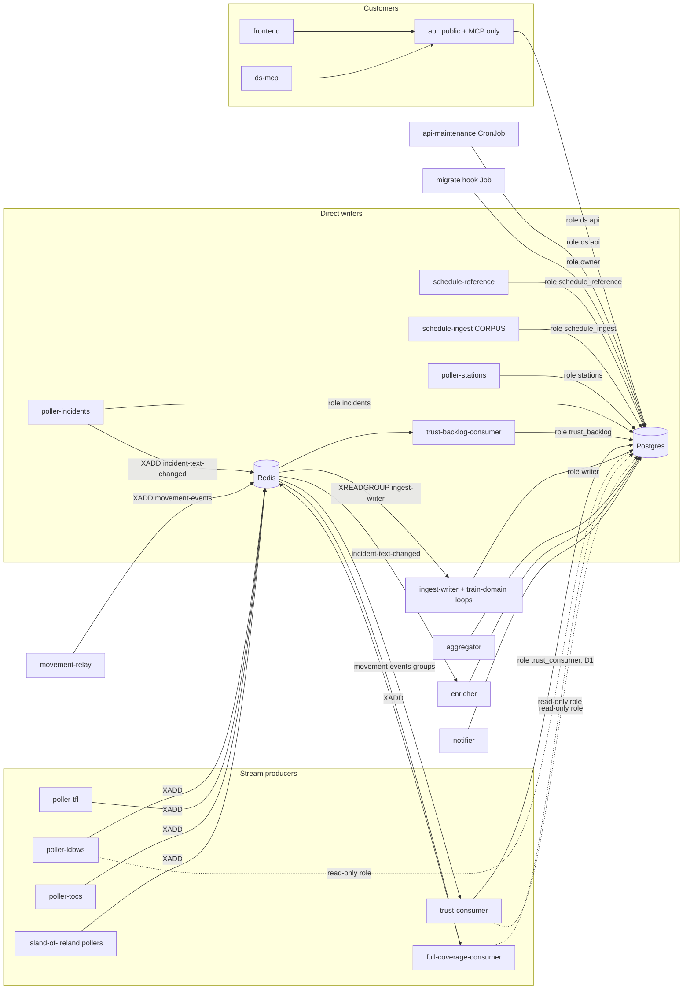

# Ingest architecture: take ingest out of the public api

Design, 2026-10-06. Status: **accepted**; the user's decisions are in
[§16, Decisions (2026-10-06)](#decisions-2026-10-06) and
[(2026-10-07)](#decisions-2026-10-07). Phase 0 is being
built (chart and tooling, all off by default). Of phase 1B, the parts that
need no `ds-store` are built and off by default: the chart (migrate hook
Job, `api.strategy.type`, the api-maintenance CronJob, the ingest-writer
Deployment and writer role), the api's `maintenance` bin and the
`ingest-writer` skeleton (§10). The phase 3a stream runtime library
(`crates/ingest-stream`, §7.7) is built with no callers.
[The plan](../plans/2026-10-06-ingest-architecture-plan.md) is how to
build it, phase by phase.

The target architecture was chosen by the user (2026-10-06). This document
designs that architecture; it does not compare it with alternatives. Where
the user left an option open, §2 makes a recommendation and §16 lists what
still needs a decision.

## Contents

1. [Summary](#1-summary)
2. [Recommendations on the open options](#2-recommendations-on-the-open-options)
3. [Sources and measurements](#3-sources-and-measurements)
4. [Target architecture](#4-target-architecture)
5. [The shared data-access crate, `ds-store`](#5-the-shared-data-access-crate-ds-store)
6. [Per-service Postgres roles and grants](#6-per-service-postgres-roles-and-grants)
7. [Stream design](#7-stream-design)
8. [Redis authentication and ACLs](#8-redis-authentication-and-acls)
9. [Direct-write producers](#9-direct-write-producers)
10. [The ingest-writer](#10-the-ingest-writer)
11. [Internal reads](#11-internal-reads)
12. [Migrations, schema ownership and background loops](#12-migrations-schema-ownership-and-background-loops)
13. [Switches, deploy order and rollback](#13-switches-deploy-order-and-rollback)
14. [Observability](#14-observability)
15. [NetworkPolicies and security posture](#15-networkpolicies-and-security-posture)
16. [Phases, effort, risks and open questions](#16-phases-effort-risks-and-open-questions)

## 1. Summary

Today the `api` Deployment does two jobs. It serves customers (the
frontend, the MCP, the public routes), and it is the only door to Postgres
for every producer. 27 `/private/*` paths (44 path-and-method pairs)
carry snapshots, event batches, multi-MB schedule chunks and the internal
reads.
It also runs every background sweep and the schema migrations.

Ingest is 96% of the api's request busy time (3,291 of 3,417 busy seconds
on 2026-10-06), yet the absolute load is small and public latency is
unaffected. The case for moving ingest out is therefore isolation, not
capacity. Three past incidents came from this coupling:

- **2026-09-26: an OOM restart loop.** Multi-MB schedule bodies and
  population reads ran in the customer-facing process.
- **2026-10-01: a retry storm during a Postgres outage.** Every producer
  hammered the api, about 516k 5xx from one consumer alone.
- **About 40 s of outage on every api deploy.** The api is `Recreate` and
  migrates at startup, because the migration history has non-backward-
  compatible steps.

The user's target:

1. **Small, frequent producers go through Redis Streams** to a new
   `ingest-writer`. There is one stream per domain, with a consumer group,
   at-least-once delivery and idempotent upserts that reuse today's
   handler code.
2. **The few massive-dump producers write Postgres directly**, each with
   its own narrow role: schedule-reference, poller-stations and
   poller-incidents, plus the rare reference data.
3. **The public api serves customers and the MCP only.**
4. **The remaining internal reads** get one recommended mechanism.
5. **Background loops and migrations** get a single, explicit owner.

The work is in six phases (§16). Every phase is behaviour-neutral until a
per-producer switch is flipped, and every switch can be flipped back.

| Phase | What | Effort (engineer-days) |
|---|---|---|
| 0 | Prerequisites: the Postgres role split (Ranma, in progress), observed per-service roles, Ranma's NetworkPolicy narrowing, Redis per-client ACL users | 5–6 |
| 1 | `ds-store` crate extraction (behaviour-neutral); the migrator Job, schema gate and `ingest-writer` skeleton that takes over the background loops | 12–15 |
| 2 | Direct writes: schedule-reference, then poller-stations, then poller-incidents (with the write-amplification fix), then schedule-ingest's CORPUS | 14–16 |
| 3 | Streams one at a time: station samples and full-coverage stats; then the TRUST backlog (direct, see §2) and train events; then TfL, tocs and island of Ireland | 15–18 |
| 4 | Internal reads move to direct, read-only, view-based access | 4–5 |
| 5 | Remove `/private` from the api; lock down grants, NetworkPolicies and OAuth groups | 3–4 |
| | **Total** | **53–64**, plus soak time between flips |

## 2. Recommendations on the open options

### R1. The TRUST backlog writes Postgres directly (no second stream)

**Recommendation:** `trust-backlog-consumer` gets its own Postgres role and
calls `ds-store`'s backlog functions itself. It does not XADD to a
`ds:ingest:trust-backlog` stream for the writer.

Reasons:

- **Its input is already a durable, consumer-grouped stream.** The
  consumer reads `movement-events` (group `trust-event-backlog`), ACKs only
  after a successful downstream write, dead-letters poison, and reclaims
  with XAUTOCLAIM. A second stream would add a second PEL, a second
  dead-letter stream and a second lag alert, and no extra durability. If
  Postgres is down, the entries wait in `movement-events`, which already
  holds about 28 hours (measured: 1,048,580 entries from id
  `1791216135409` to `1791317902973`).
- **It is the largest ingest load.** It made 71.6k POSTs a day
  (0.83/s, 2,116 busy seconds, 64% of all ingest busy time), carrying
  about 509 events a minute (206 KB of JSON a minute). A second hop would
  write all of that into Redis twice (about 300 MB a day of extra AOF
  traffic) for no benefit.
- **Same at-least-once semantics, one hop less.** Today: XREADGROUP →
  POST → api transaction → 200 → XACK. Direct: XREADGROUP → transaction →
  commit → XACK. A crash between commit and XACK redelivers, and the
  writes are idempotent by `dedup_key` exactly as today.
- **It removes the retry-storm path.** On a transient DB failure the
  consumer backs off (1 s doubling to 60 s, jittered) before reading again,
  instead of POSTing to an api that may be failing too (§9.5).

Cost: one more DB role and a small pool (3 connections), and the binary
grows by sqlx.

**The same argument applies to `trust-consumer`'s train events and
forward signals.** It also reads `movement-events`, so a second stream is
also a double hop. The user's target names train events as a stream
producer, so this design first kept them on a stream
(`ds:ingest:train-events`, §7). The volume is tiny (no train-event POSTs
in the 24 h measured; 21 active subscriptions).

**Decided (D1, 2026-10-06): trust-consumer writes its train events and
forward signals directly to Postgres**, exactly like the backlog: its own
role `distant_signal_trust_consumer`, XACK of `movement-events` only after
the commit, and back-off on a transient DB failure. There is no
`ds:ingest:train-events` stream. Where later sections still describe that
stream, D1 overrides them.

### R2. Internal reads go direct to Postgres, through narrow views

**Recommendation:** no internal read API. Each reader gets a read-only role
with `SELECT` on exactly the tables or views it needs, and calls `ds-store`
read functions. Each producer works out its own "last fetched" cursor.

| Today's route | Caller | Replacement |
|---|---|---|
| `GET /private/schedule-line-population` (139k requests/day, 54% of all api requests; 58k `200`, 82k `304`) | full-coverage-consumer, every 300 s, 486 `(line, date)` pairs | One `SELECT line_id, service_date, updated_at` per cycle (the "ETag" list), then fetch only changed rows by key. This is the same conditional logic as the ETag, without HTTP |
| `GET /private/tracked-trains` (1.4k/day) | trust-consumer | `SELECT` on a view `ingest_active_tracked_trains` (no user ids) |
| `GET /private/sample-stations` (1.4k/day) | poller-ldbws | `SELECT` on a view `ingest_sample_station_pins` (pin counts per line, no user ids) and on custom-line station lists through a view; the line catalogue from the image (the aggregator already does this) |
| `GET /private/stanox-crs` (66/day) | trust-consumer, full-coverage-consumer, trust-backlog-consumer | `SELECT` on `stanox_crs` |
| `GET` last-fetched cursors (per producer, at startup) | every poller | Direct writers read their own freshness row. Stream producers read the last entry of their own stream (`XREVRANGE … COUNT 1`) and need no DB access |

Reasons:

- **The ETag benefit survives, and gets cheaper.** Today: 486 conditional
  GETs every 5 minutes. Direct: one version query of about 1,215 rows, then
  only the rows whose `updated_at` moved. `get_schedule_line_population_conditional`
  already does the comparison in SQL, so it moves to `ds-store` as is.
- **It removes the OOM path rather than moving it.** Multi-MB population
  JSON no longer passes through an HTTP server at all. The consumer already
  holds the populations in memory (438 Mi).
- **The aggregator already works this way.** It computes the
  sample-station set itself (`aggregation.rs`, "the same set api's
  `/private/sample-stations` serves") and reads and prunes the schedule
  tables straight from Postgres.
- **A read API would be one more always-on service**, with the internal
  OAuth machinery kept alive only for three readers.

Cost: three more read-only roles and small pools (4 connections in all),
and schema coupling. The coupling is handled by the views (a stable
interface owned by migrations) and by the schema gate and expand/contract
rules (§12). The views also keep personal data (`pinned_lines.user_id`,
`train_subscriptions.user_id`) out of reach.

### R3. Migrations: a Helm hook Job. Train-domain loops: the ingest-writer. User-data sweeps: an api-image CronJob

**Recommendation:**

- **Migrations** run in a `migrate` Job: the api image's new
  `ds-migrate` binary, as a Helm `pre-upgrade` and `post-install` hook,
  connecting as the owner role.
  - A failed migration fails the release, and the old pods keep serving.
  - The owner password lives only in that Job's pod.
  - Every DB-using service waits in-process for the schema it was built
    for (the "schema gate", §12.2) before it binds or spawns loops.
- **The train-domain loops** (schedule-match, reconciliation,
  backlog-match, the CORPUS crosswalk rebuild and freshness gauge) move to
  the `ingest-writer`. It is single-replica, `Recreate`, and each loop also
  holds a session-level advisory lock, so a stray second replica cannot
  double-run one.
- **The user-data sweeps** (expired sessions, dead links, personal-data
  retention) move to an hourly `CronJob` running `api-maintenance` from the
  api image, with the api's own role and `concurrencyPolicy: Forbid`.
  Those sweeps touch only tables the api already owns. Putting them in the
  writer would give the writer `DELETE` on users, sessions and journeys.

With migrations and loops gone, the api can move from `Recreate` to
`RollingUpdate`, which ends the roughly 40 s outage per deploy (§12.4).

### R4. Where the rare reference data lands

- **CORPUS** (`/private/corpus-locations`, monthly, 56k rows, 15 MB of
  JSON, a whole-table replace under an advisory lock) and
  **`schedule-feed-ingests`** both come from **schedule-ingest**, not
  schedule-reference. schedule-ingest becomes a fourth direct writer with
  its own role (phase 2d). A 15 MB replace does not fit a 512 KiB stream
  entry, and it needs one transaction.
- **tocs** (40 rows, daily, about 3 KB) go on a small
  `ds:ingest:reference` stream in phase 3. They are too small to justify a
  DB role.
- The **island-of-Ireland** pollers are disabled. They move to the
  `ds:ingest:island-of-ireland` stream in phase 3c like the others and stay
  disabled by default (D8). They keep no HTTP path, so phase 5 deletes
  nothing for them; they need not be prod-tested until enabled (Q9).

### R5. The incidents write amplification: write only what changed (phase 2c)

The incidents upsert already skips unchanged content (`IS DISTINCT FROM`).
The amplification is the separate per-poll `UPDATE incidents SET
fetched_at = NOW(), …` over **every** listed incident:

- 1,066,607 updates in 42 h (96% HOT) for a 2,112-row table;
- about 2.1k row updates every 5 minutes, about 600k a day.

Fix (§9.4): keep a feed-level "last snapshot" timestamp, and touch a row
only when its content changes or it changes listing state. The display time
of a listed incident becomes the feed time. Expected: tens of row updates a
day plus 288 single-row writes.

## 3. Sources and measurements

**Code** (worktree of `main` at `c32285b3`):

- `crates/api/src/{app.rs,main.rs,migrate.rs}`;
- `crates/api/src/routes/{ingest.rs,samples.rs,mod.rs}`;
- `crates/api/src/data/*`: in particular `queries.rs` (14.4k lines),
  `trust_event_backlog.rs`, `train_tracking.rs`, `trains.rs`,
  `incident_removal.rs`, `corpus*.rs`, `full_coverage_window.rs`,
  `island_of_ireland.rs`, `schedule_matching.rs`, `reconciliation.rs`,
  `trust_event_backlog_match.rs`, `retention.rs`;
- `crates/common/src/{ingest.rs,pg.rs,redis_auth.rs,redis_conn.rs}`;
- the producer crates;
- `charts/distant-signal/templates/{networkpolicy,postgres-roles,api-deployment,schedulefeed-deployment,prometheusrule}.yaml`;
- `charts/distant-signal/files/postgres-roles.sql`, `values.yaml`.

**Docs:**

- `docs/postgres-app-role.md`;
- [2026-09-30-redis-message-queue-evaluation-design](2026-09-30-redis-message-queue-evaluation-design.md);
- [2026-10-06-incident-source-removal-design](2026-10-06-incident-source-removal-design.md).

**Production, read only, 2026-10-06 about 20:15–20:30 UTC.** Measured with
`kubectl get/top`; Prometheus over a port-forward (since stopped);
`redis-cli` `INFO`, `XINFO`, `XLEN`, `MEMORY USAGE` and `ACL LIST` with
hashes redacted; and Postgres `SELECT`s under
`default_transaction_read_only`. No Secret values or key contents were
read. Many pods had been redeployed minutes earlier, so the 24 h Prometheus
figures sum across pod generations.

### 3.1 api requests, last 24 h

| Route | Method | Requests/24 h | Busy s/24 h | Note |
|---|---|---|---|---|
| `/private/schedule-line-population` | GET | 139,381 | 384 | 58k `200`, 82k `304` |
| `/private/trust-event-backlog` | POST | 71,594 | 2,116 | the largest ingest load |
| `/private/train-reasons` | POST | 2,340 | 12 | |
| `/private/sample-stations` | GET | 1,437 | 8 | |
| `/private/station-samples` | POST | 1,433 | 137 | |
| `/private/tracked-trains` | GET | 1,397 | 4 | |
| `/private/full-coverage-stats` | POST | 1,382 | 10 | |
| `/private/full-coverage-window-stats` | POST | 1,382 | 152 | |
| `/private/station-full-coverage-samples` | POST | 1,326 | 68 | |
| `/private/schedule-line-population` | POST | 496 | 181 | |
| `/private/incidents` | POST | 284 | 79 | |
| `/private/tfl-line-status` | POST | 284 | 3 | |
| `/private/stanox-crs` | GET | 66 | 1 | |
| `/private/schedule-calling-points-full` | POST | 61 | 77 | |
| `/private/schedule-destination-departures` | POST | 38 | 58 | |
| everything `/private` | | about 222k | **3,291** | |
| everything public | | about 34k | **127** | mean 3.8 ms |

Total api requests were 256k. Routes not listed (stations, tocs, crosswalks,
fixed links, network departures, markers, train events) had no requests in
the window.

### 3.2 Payload sizes

These are derived from the stored rows as JSON (`row_to_json`). The bodies
are the same structs, so the sizes are close.

| Domain | Per cycle | JSON per cycle | Cadence |
|---|---|---|---|
| station samples | 560 stations | 2.8 MB (about 5 KB per station) | 1/min |
| full-coverage line stats | 243 rows | 80 KB | 1/min |
| full-coverage window stats | about 486 rows | 290 KB | 1/min |
| station full-coverage samples | 3,524 rows | 640 KB | 1/min |
| TRUST backlog | about 509 events/min (8.5/s) | 206 KB/min (about 13 events and 5 KB per POST) | 0.83 POST/s |
| TfL line status | 20 lines | 10 KB | 1/5 min |
| tocs | 40 rows | about 3 KB | daily |
| incidents | 2,113 incidents | 6.2 MB stored (the poller sends 2–4 MB) | 1/5 min |
| stations | 2,614 stations | 38.5 MB | daily |
| CORPUS | 55,981 locations | 15 MB | monthly |
| schedule-line-population | 1,215 rows: average 674 KB, max 3.1 MB, 800 MB total | per row | per publish |
| schedule calling points / destination departures | 50k-row chunks, about 5 MB each | | about 58 chunks/day |

### 3.3 Redis

| Item | Value |
|---|---|
| Memory | 821 MB used, 853 MB RSS, maxmemory 1.5 GB, `noeviction`, fragmentation 1.04 |
| Keys | `movement-events` (stream, 1,048,580 entries, `MEMORY USAGE` about 965 MB sampled, so about 820 B per entry; about 28 h; 10.3 entries/s) and `incident-text-changed` (6,471 entries, 340 KB). No dead letters |
| Groups | `trust-consumer` and `full-coverage-consumer`: lag 282, pending 0. `trust-event-backlog`: lag 0. `enricher`: lag 0 |
| AOF | 386 MB (230 MB base) |
| Auth | **`requirepass` is now on** (the Deployment has `--requirepass $(REDIS_PASSWORD)`; `ACL LIST` shows `user default on … #<hash> ~* &* +@all`). This is D1 of the Redis evaluation, rolled out. There is still one shared password with `+@all` |
| Clients | 8 connections from 6 addresses |

**Headroom for new ingest streams is about 675 MB.** Everything below is
sized to stay under a 128 MB budget for all `ds:ingest:*` and `ds:dlq:*`
keys together (§7.6).

**Updated 2026-10-07 (D5):** production `maxmemory` is now 2 GB (the
chart default is still `1536mb`), and the ingest budget is **512 MB**,
alerting at 75%.

### 3.4 Postgres

| Item | Value |
|---|---|
| `max_connections` | 100; `superuser_reserved_connections` 3; `reserved_connections` 0 |
| Roles | only `distant_signal` (superuser). The role split is not applied yet; Ranma-Config is rolling it out |
| Connections in use | api 6 (5 idle), notifier 5, aggregator 4, enricher 1, others 2: **18 of 100**. The api pool allows 50 |
| Tables in `public` | 69 (plus 16 sequences, the `pg_stat_statements` views, and one function `analyze_publish_keys`) |
| Updates over 42 h (since the last Postgres restart) | `station_full_coverage_samples` 13.2M (3.5k rows), `station_samples` 1.66M (560 rows), `full_coverage_line_window_stats` 2.35M, `line_status` 1.35M (aggregator), `incidents` 1.07M (2.1k rows). All are over 85% HOT. Each one is a timestamp bump on an otherwise unchanged row |

## 4. Target architecture

Dependency direction for the code: `common` ← `ds-store` ← {api,
ingest-writer, ds-migrate, the direct writers, the readers}. `ds-store`
depends on neither `axum` nor `redis` nor `reqwest`.

## 5. The shared data-access crate, `ds-store`

### 5.1 Boundary and dependency rules

`crates/ds-store` is a library crate with `publish = false` and the
workspace lints.

- **Depends on:** `common` (default features off, `postgres` on: the
  default `http` feature brings reqwest and the metrics listener's hyper),
  `sqlx` (the api's feature set minus `migrate` and `macros`, plus
  `derive`), `chrono`, `chrono-tz`, `serde`, `serde_json`, `anyhow`,
  `tracing`, `metrics`, `rand`, `tokio`, `trust-schema` and
  `schedule-query`. 1A.1 declares them all up front, so the parallel
  moves rarely edit the manifest.
- **Never depends on:** `axum`, `tower*`, `hyper`, `redis`, `reqwest`,
  `openidconnect`/`oauth2`, or `api`.
  - A CI step (`scripts/check-crate-deps.py`, typed stdlib Python) fails
    if `cargo tree -p ds-store -e normal` shows any of them in
    `ds-store`'s normal dependency closure. (`cargo metadata` unifies
    features across the workspace, so it would report `common`'s
    defaults, which `ds-store` turns off.)
  - Redis stays out on purpose: functions that today publish to Redis
    (`upsert_incident_snapshot`) instead **return** what to publish, and
    the caller publishes.
- **Owns:** the SQL for every table that more than one binary writes or
  reads, the publish protocols, the input validation the `/private`
  handlers do today, the pool builder with pool metrics, the schema gate,
  and (from phase 1B) the migrator library.
- **The api keeps:** routes, rendering, auth, sessions, rate limits,
  ticket parsing, trip planning, and every query used only by public routes.
  Those are moved only when another binary needs them.

### 5.2 What moves, by module

"Moves" means the function, its private helpers, its types and its DB
tests move unchanged. The api keeps `pub use ds_store::…` shims in
`crates/api/src/data/*` during phase 1A, so no call site changes in the
move commits.

| `ds-store` module | From (file → functions/types) | Used by after the move |
|---|---|---|
| `pool` | `common::pg::PoolSettings` (wrapped, not moved), plus new pool metrics (§14.2) | every DB service |
| `schema` | new: `REQUIRED_MIGRATION` (the newest embedded migration version), `wait_for_schema(pool, deadline)` | every DB service (§12.2) |
| `migrate` (phase 1B) | `crates/api/src/migrate.rs` (whole file: `run`, `MigrationSettings`, `migration_url`, the INVALID-index heal); `data::legacy_backfill::ensure_ready_for_contract_migration` | `ds-migrate` |
| `freshness` | `queries.rs` → `record_ingest` (now `pub`), `last_stations_fetch`, `last_tocs_fetch`, `last_incidents_fetch`, `last_station_samples_fetch`, `last_station_full_coverage_samples_fetch`, `last_tfl_line_status_fetch`, `last_full_coverage_line_stats_fetch`, `data_freshness`; `last_per_key`, `normalize_code` | writer, direct writers, api (freshness route) |
| `incidents` | `queries.rs` → `upsert_incident_snapshot` (split, §9.4), `upsert_incidents`, `IncidentSnapshotOutcome`, `ExistingIncident`, `incident_changed`, `text_changed`, `load_station_gazetteer`, `UPSERT_CHUNK_SIZE`; `incident_removal.rs` (whole: `infer_removals`, `judge`, `Inference`, `register_metrics`, the constants); `routes/ingest.rs` → `incident_snapshot_from_body` (as `parse_snapshot`) | poller-incidents, api (shim until phase 5) |
| `reference` | `queries.rs` → `upsert_stations`, `upsert_tocs`, `upsert_stanox_crs`, `prune_stanox_crs_not_in`, `list_stanox_crs(_with)`, `list_stanox_crs_for_crs(_with)`, `upsert_tiploc_crs`, `prune_tiploc_crs_not_in`, `list_tiploc_crs(_with)`, `upsert_fixed_links`, `crs_for_tiploc(_with)`, `crs_for_tiplocs_batch(_with)` | poller-stations, schedule-reference, writer (tocs), readers, api (reads) |
| `corpus` | `corpus.rs` (whole: `replace_corpus_locations(_with_provenance)`, `DeliveredFileProvenance`, `CorpusLocation`, `last_corpus_delivery`, `refresh_last_delivery_metric`, `take_load_lock`); `corpus_crosswalk.rs` (whole); `corpus_comparison.rs` → `log_after_load`; `routes/ingest.rs` → `corpus_load_problem`, `is_sha256_hex` | schedule-ingest, writer (rebuild loop), api (reads) |
| `schedule` | `queries.rs` → `SchedulePublishPart`, `PublishKeysSql`, both `*_PUBLISH_KEYS_SQL`, `discard_superseded_publish_keys`, `finish_publish_part(_declaring)`, `finish_publish_without_rows`, `finish_schedule_{destination_departures,calling_points_full}_publish_without_rows`, `upsert_schedule_{destination_departures,calling_points_full}_publish_part`, `upsert_schedule_{destination_departures,calling_points_full,network_departures}`, `ScheduleDestinationDeparturesRow`, `ScheduleCallingPointsFullRow`, `ScheduleNetworkDeparturesRow`, `upsert_schedule_line_population`, `get_schedule_line_population(_conditional)`, `ConditionalPopulation`, `SchedulePublishBusy`, `is_statement_timeout`, `register_schedule_publish_metrics`, the timeouts, `in_process_publish_id`; `insert_schedule_feed_ingest`, `ScheduleFeedSource`, `last_schedule_feed_fetch`, `insert_schedule_reference_publish`, `last_completed_schedule_reference_publish`; `routes/ingest.rs` → `ScheduleChunkParams::part` and `empty_publish_date` validation (as `SchedulePublishPart::new`), `schedule_feed_ingest_problem` | schedule-reference, schedule-ingest, full-coverage-consumer (reads), api (public reads) |
| `samples` | `queries.rs` → `upsert_station_samples`, `upsert_station_full_coverage_samples`, `upsert_tfl_line_status`, `upsert_full_coverage_line_stats`; `full_coverage_window.rs` → `validate`, `upsert_full_coverage_window_stats`, `last_full_coverage_window_stats_fetch`, `bucket_start`; `island_of_ireland.rs` → `upsert_stations`, `upsert_lines`, `upsert_station_samples`, the three `last_*_fetch` | writer, api (reads stay in api) |
| `trains` | `trains.rs` → `find_or_create_train(s_batch)`, `find_or_create_train_with_schedule_match`, `bind_subscription_unless_other_train`, `mark_train(s)_resolved(_batch)`, `destination_crs_for_train(s_batch)`; `eta_blend::london_to_utc`; `stop_delay.rs` (whole); `stop_live_status.rs` (whole); the domain types `JourneyStop`, `StopStatus`, `StopTimetable` out of `journey.rs` (into `trains::types`; `journey.rs` re-exports them) | api (public tracking), writer, trust-backlog-consumer |
| `tracking` | `train_tracking.rs`, ingest half only: `upsert_train_movement(_on)`, `upsert_train_event(_on)`, `upsert_train_events_batch`, `reopen_subscriptions_after_reinstatement`, `apply_schedule_match`, `list_pending_pins_for_{schedule,backlog}_match`, `list_active_tracked_trains`, `TrackedTrainState`; `notifier_forward_queue::insert_forward_signals`; the validators used by both halves (`routes::validate_short_text`, `validate_code_list`, `is_crs_code`) into `ds_store::validate` | writer, trust-consumer (read), api |
| `backlog` | `trust_event_backlog.rs` (whole: `upsert_trust_event_backlog_batch`, `ingest_shared_movement(s_batch)`, `classify_anyhow_data_error`, `register_uid_inference_metrics`, `replay_uidless_backlog`); `train_reasons::upsert_reasons`, `reason_text`, `reason_fields`; `trust_event_backlog_match.rs` (whole: `run_backlog_match_sweep`) | trust-backlog-consumer, writer (sweep), api (`replay_uidless_movements` bin) |
| `sweeps` | `schedule_matching::run_schedule_match_sweep`, `find_schedule_match`; `reconciliation::run_reconciliation_sweep` | writer |
| `reads` (phase 4) | `samples::select_sample_stations`, `dedup_sample_stations`, `SampleSelection` (pure functions); new `list_population_versions`; the view-backed readers | poller-ldbws, full-coverage-consumer, trust-consumer |

**Stays in `api`:** `train_tracking.rs`'s user-facing half (`create_pin`,
`validate_pin`, `create_subscription_for_train`, the ticket functions,
`list_tracked_trains_for_user`, …), `journeys`, `journey_templates`,
`groups`, `users`, `account`, `retention`, `unlisted_links`,
`preferences`, `custom_lines`, the trip-planning modules, `render.rs`, and
the public read queries in `queries.rs` (`search_incidents`,
`line_status_for_*`, the stats readers and so on).

Two module-level entanglements need care in phase 1A:

1. **`train_tracking.rs` calls `crate::routes::{validate_short_text,
   validate_code_list, is_crs_code}`.** These are pure string checks. They
   move to `ds_store::validate`, and `routes/mod.rs` re-exports them.
2. **`queries.rs` and `trains.rs` reach into `render.rs` and `journey.rs`
   only from their test modules** (`render::schedule_departure_json`,
   `journey::stops_from_calling_points`). The tests that need them stay in
   `api` as integration tests against the re-exported API.

`train_tracking.rs` (7.7k lines) is split, not moved: the ingest functions
listed above move, and the rest stays. This is the largest single task and
gets its own commit series.

### 5.3 How each binary uses it

| Binary | `ds-store` modules | Pool (connections) |
|---|---|---|
| api | everything above, through the shims; then direct imports | 16 per replica |
| api-maintenance (CronJob) | `pool`, `schema` (the sweeps themselves stay in `api`) | 2 |
| ds-migrate | `migrate`, `schema` | 2 (owner) |
| ingest-writer | `samples`, `reference` (tocs), `tracking`, `sweeps`, `backlog` (match sweep), `corpus` (crosswalk loop), `freshness`, a new `dedup` | 6 |
| trust-backlog-consumer | `backlog`, `trains`, `tracking` (movement upserts), `reference` (stanox reads) | 3 |
| schedule-reference | `schedule`, `reference` (crosswalks, fixed links) | 3 |
| schedule-ingest | `corpus`, `schedule` (feed-ingest markers) | 1 |
| poller-stations | `reference::upsert_stations`, `freshness` | 1 |
| poller-incidents | `incidents`, `freshness` | 2 |
| full-coverage-consumer (read) | `schedule::get_schedule_line_population_conditional`, `reads::list_population_versions`, `reference::list_stanox_crs` | 2 |
| trust-consumer (read) | `tracking::list_active_tracked_trains` (via the view), `reference::list_stanox_crs` | 1 |
| poller-ldbws (read) | `reads::*` | 1 |
| aggregator, enricher, notifier | `pool` (metrics) and `schema` only; their own queries are out of scope | unchanged |

### 5.4 sqlx offline and query checking

**There are no compile-time-checked queries in the workspace.** The
workspace deliberately uses runtime `sqlx::query`/`query_as`. There is no
`.sqlx/` directory, no `SQLX_OFFLINE` in CI or in any Dockerfile, and no
`cargo sqlx prepare` step. The comments in `api/src/data/reference.rs`
and `enricher/src/{queries,sweep}.rs` record the choice.

Consequences:

- **The extraction needs no query cache.** The extraction does not touch a
  `.sqlx` cache, and building `ds-store` needs no database.
- **Query correctness keeps coming from the DB-gated `#[ignore]` tests.**
  They move with their functions. `ds-store`'s suite runs on a fresh,
  migrated database in CI (`rust-db-test`), and it **also runs once per
  narrowed role** (§6.5). A query a role cannot run fails there, not in
  production.
- **Recommendation: do not adopt `query!` in `ds-store`.** It would need
  `cargo sqlx prepare --workspace`, a committed `crates/ds-store/.sqlx/`,
  `SQLX_OFFLINE=true` in every Dockerfile that builds a `ds-store`
  dependent (eight images by phase 4), and a CI check that the cache is
  current. That is all new machinery for a guarantee the per-role DB
  suites already give.
- **`sqlx::migrate!`** embeds `crates/api/migrations` at compile time. It
  moves into `ds-store::migrate` in phase 1B.1, and the directory moves
  with it to `crates/ds-store/migrations` (D9). The 1A moves leave the
  directory where it is. 1B.1 updates every path that names it:
  `migration_checksums`, `migration_index_locking`,
  `scripts/check-migration-order.py`, `scripts/gen-db-grants.py`, the
  Dockerfiles and CI.

### 5.5 Phasing the move so it is behaviour-neutral

Phase 1A is a series of pure moves, each green on the full CI matrix:

1. Create the empty crate and wire the workspace, the lints and
   `check-crate-deps.py`.
2. Move the leaf modules: `validate`, `freshness`, the `trains` types and
   functions, `stop_delay`, `stop_live_status`, `eta_blend::london_to_utc`.
3. Move `samples`, `reference` and `corpus`.
4. Move `schedule`.
5. Move `incidents` (without the split yet).
6. Split `train_tracking`. Move `tracking`, `backlog` and `sweeps`.
7. Add the `pool` metrics and `schema::REQUIRED_MIGRATION` (no caller
   yet).

After each step:

- `cargo test --workspace` and the DB-gated suites pass on a fresh DB;
- `scripts/test-postgres-roles.py` passes;
- the api binary's routes, SQL text and metrics names are unchanged. A
  test diff of the `/metrics` series names before and after, and of
  `pg_stat_statements` normalised query text in a local run, shows no
  change.

## 6. Per-service Postgres roles and grants

### 6.1 Starting point

`docs/postgres-app-role.md` and `charts/distant-signal/files/postgres-roles.sql`
create five roles:

- `owner`: migrations;
- `app`: DML on everything, for every pool;
- `exporter`, `dump` and `backup`.

They are built and off; Ranma-Config is rolling them out now (phase 0a).
This design keeps those five and splits `app` by service.

### 6.2 Mechanism

The grants become data:

- **`charts/distant-signal/files/db-grants.yaml`** is the single source of
  truth. It lists every table in `public` with:
  - a `class`: `personal`, `shared-train`, `ingest`, `derived`,
    `reference`, `internal` or `migrations`;
  - its writers, each with `insert`/`update`/`delete` and an optional
    column list;
  - its readers.

  It also lists every view and sequence.
- **`scripts/gen-db-grants.py`** (typed stdlib Python plus PyYAML, run
  with `uv run`) renders `charts/distant-signal/files/postgres-grants.sql`.
  That file holds:
  - `CREATE ROLE … NOLOGIN` group roles and per-service `LOGIN` roles;
  - the `GRANT`s, with `REVOKE` of anything not listed;
  - `ALTER DEFAULT PRIVILEGES` that give **nothing** to the service roles,
    so a new table is invisible until classified;
  - the `CONNECTION LIMIT`s.

  The existing setup Job runs `postgres-roles.sql` and then this file, both
  idempotent.
- **CI checks, all in `rust-db-test` after the migrations run on a fresh
  DB:**
  1. **Every table, view and sequence in `public` is classified.**
     `gen-db-grants.py check --database-url …` lists `pg_class` and fails
     on anything missing from `db-grants.yaml`, or listed there but
     absent.
  2. **`postgres-grants.sql` is current.** It must equal the generator's
     output.
  3. **Each service's DB suite runs as that service's role**
     (`scripts/test-postgres-roles.py --mode per-service`).

  A migration that adds a table without classifying it fails CI, not
  production.

### 6.3 The roles

All roles are `LOGIN NOSUPERUSER NOCREATEDB NOCREATEROLE NOREPLICATION
NOBYPASSRLS`, have passwords, and have the usual `CONNECT`, `USAGE` on
`public` and `TEMP`. None gets `TRUNCATE`, `REFERENCES`, `TRIGGER` or
`CREATE`. Foreign-key cascades need no grants: Postgres runs the
referential-integrity triggers as the table owner.

| Role | Used by | From phase |
|---|---|---|
| `distant_signal_owner` | migrate Job only | 0a (exists), moves out of the api in 1B |
| `distant_signal_api` | api pools; api-maintenance CronJob | 0b (observed), narrowed in 5 |
| `distant_signal_writer` | ingest-writer | 1B |
| `distant_signal_schedule_reference` | schedule-reference | 2a |
| `distant_signal_stations` | poller-stations | 2b |
| `distant_signal_incidents` | poller-incidents | 2c |
| `distant_signal_schedule_ingest` | schedule-ingest | 2d |
| `distant_signal_trust_backlog` | trust-backlog-consumer | 3b |
| `distant_signal_full_coverage_ro` | full-coverage-consumer | 4 |
| `distant_signal_trust_consumer` | trust-consumer: train events and forward signals (direct, D1), plus its reads | 3b (reads from 4) |
| `distant_signal_ldbws_ro` | poller-ldbws | 4 |
| `distant_signal_aggregator`, `_enricher`, `_notifier` | the three existing workers | 0b (observed), narrowed in 5 |
| `distant_signal_exporter`, `_dump`, `_backup` | as today | 0a |
| `distant_signal_app` | retired in phase 5. Until then it is the group role every observed service role is a member of | |

Group roles (`NOLOGIN`):

- `distant_signal_read_shared`: `SELECT` on every non-`personal` table.
  Granted to api, writer, aggregator and notifier.
- `distant_signal_schema_gate`: `SELECT` on `_sqlx_migrations`. Granted to
  every login role.

### 6.4 Grants by table group

Privileges are written S, I, U and D. Column lists are in brackets. "All
S" means through `distant_signal_read_shared`.

| Tables | api | writer | direct writers | readers and others |
|---|---|---|---|---|
| **Personal** (`users`, `sessions`, `oidc_login_state`, `pinned_*`, `custom_lines`, `custom_line_group_grants`, `groups`, `group_*`, `journeys`, `journey_legs`, `journey_templates`, `journey_template_legs`, `journey_template_skipped_dates`, `push_subscriptions`, `tracked_train_tickets`, `unlisted_links`) | SIUD | – | – | notifier: S on what it notifies from (`push_subscriptions`, `journeys`, `journey_legs`, `users`, …; phase 0b gives the exact list), plus D on `push_subscriptions` (gone endpoints, `notifier/src/queries.rs`); aggregator: S on `custom_lines` (custom-line status), or the `ingest_custom_line_stations` view once it exists; dump: S (all) |
| **Shared train** `trains` | SIU (+D: the journey cleanup path) | SIU | trust_backlog: SIU | aggregator: SUD (archive/expiry); notifier: S |
| `train_subscriptions` | SIUD | SU (match sweeps bind) | trust_backlog: SU (reinstatement reopen) | notifier: S; trust_consumer_ro: through the view only |
| `train_movement_events`, `train_current_state` | S (+I/D only if 0b observes it; the public "replay" paths) | SIU | trust_backlog: SIU | aggregator: SID (archive) |
| `trust_event_backlog` | S | SU (backlog-match sweep) | trust_backlog: SI | aggregator: SD (retention) |
| `train_reasons` | S | – | trust_backlog: SIU | |
| `notifier_forward_queue` | S | SI | – | notifier: SD |
| **Notifier state** (`notifier_cursor`, `train_notification_state`, `line_notification_state`, `journey_leg_notification_state`) | S (+D if 0b observes the account-deletion path) | – | – | notifier: SIUD |
| **Ingest snapshots** `station_samples`, `station_full_coverage_samples`, `full_coverage_line_stats`, `full_coverage_line_window_stats`, `island_of_ireland_*` | S | SIU | – | aggregator: S, plus D on `station_samples` and U/I on `full_coverage_line_stats` (it writes both today); readers: S where §11 lists it |
| `line_status`, `line_status_history` | S | SIU (TfL rows) | – | aggregator: SIUD |
| `line_status_*_stats`, `full_coverage_window_verdicts` | S | – | – | aggregator: SIUD |
| `stations` | S | S | stations: SIU; incidents: S | – |
| `tocs` | S | SIU | – | – |
| `incidents` | S | – | incidents: SIU | enricher: S, plus U on the extraction columns only |
| `incident_history`, `incident_feed_state` | S | – | incidents: SI on history; SIU on feed state | – |
| `ingest_freshness` | S | SIU (tfl, tocs) | stations, incidents: SIU | – |
| `schedule_calling_points_full`, `schedule_destination_departures`, `schedule_network_departures`, `schedule_line_population` | S | – | schedule_reference: SIUD | aggregator: SD (retention); full_coverage_ro: S on `schedule_line_population` |
| `schedule_services` (2026-10-06), `tiploc_locations` (2026-10-07) | S | – | schedule_reference: SIUD | aggregator: SD on `schedule_services` (retention); notifier: S on `schedule_services` (no live alerts for a bus or ferry) |
| `line_train_summaries` (2026-10-08; derived with each `schedule_line_population` publish, in its transaction) | S | – | schedule_reference: SIUD | aggregator: SD (retention, with the population). The one-off `backfill_line_train_summaries` runs in the api pod with the api's credentials, so it runs before the api is narrowed (or moves with the writer) |
| `*_publish_keys` (two tables) | – | – | schedule_reference: SID; EXECUTE `analyze_publish_keys` | – |
| `schedule_reference_publishes` | S | – | schedule_reference: SI | – |
| `schedule_feed_ingests` | S | – | schedule_ingest: SI | – |
| `stanox_crs`, `tiploc_crs`, `fixed_links` | S | S | schedule_reference: SIUD | the three movement consumers: S on `stanox_crs` |
| `corpus_locations`, `corpus_deliveries` | S | S | schedule_ingest: SIUD | – |
| `corpus_crosswalk_build`, `corpus_stanox_crs`, `corpus_tiploc_crs` | S | SIUD | – | – |
| `ingest_dedup` (new, §7.4) | – | SID | – | – |
| `_sqlx_migrations` | S | S | S | S (everyone, through `schema_gate`); owner: all |
| **Views (phase 4)** `ingest_active_tracked_trains`, `ingest_sample_station_pins`, `ingest_custom_line_stations` | – | – | – | trust_consumer_ro and ldbws_ro: S on their view only |

**Sequences:** `USAGE, SELECT` (and `UPDATE` only where needed) on the
sequence of each table a role inserts into.

**What the api needs after phase 5, stated plainly:**

- SIUD on the personal tables;
- SIU on `trains`, SIUD on `train_subscriptions`, and whatever phase 0b
  observes it writing on `train_movement_events`/`train_current_state` from
  public routes;
- `SELECT` on everything else, through `read_shared`;
- nothing on `*_publish_keys` or `ingest_dedup`.

The public routes do write shared tables: `find_or_create_train` from
`routes/train.rs` and `routes/journeys.rs`, and the pin/subscription
paths. That is why `trains` and `train_subscriptions` keep api writes.

**Row-level restriction on `line_status` (D10).** The writer and the
aggregator both write `line_status`, split by `source` and the `tfl-`
prefix. Postgres RLS pins the writer to TfL rows: `ENABLE ROW LEVEL
SECURITY` on `line_status`, a policy for the writer role whose `USING` and
`WITH CHECK` allow only TfL rows, and permissive `USING (true)` policies
for every other role that reads or writes the table, so their access is
unchanged. It ships with the writer's TfL handler (plan 3c.3); any earlier
direct TfL writer gets the same policy.

### 6.5 Deriving the grants from evidence (phase 0b)

The static classification above comes from reading the code. It is
checked against production before any role is narrowed:

1. **Create per-service login roles** that are members of
   `distant_signal_app` and inherit all of its privileges. Switch each
   service to its own role. Nothing changes functionally.
2. **After 7 days, read `pg_stat_statements` grouped by `userid`.**
   `scripts/observe-role-usage.py` (read-only) extracts the tables each
   statement touches and with which verb. It writes a report diffed against
   `db-grants.yaml`.
3. **Each narrowing (phases 2 to 5) starts from that report.** Anything
   the code does that the observation window did not see is covered by the
   per-role DB suites in CI.

### 6.6 Connection budget

`max_connections` is 100, and the 3 `superuser_reserved_connections` stay
for humans. The roles' `CONNECTION LIMIT`s must sum to at most 97. The
chart's render-time budget check (INF-7, `api-deployment.yaml`) is extended
to sum every role's limit. It fails the render if the sum exceeds
`max_connections − superuser_reserved_connections`.

| Role | Pool | Limit | Note |
|---|---|---|---|
| api | 16 per replica | 34 | 2 pods during a RollingUpdate surge, plus 2 for the CronJob. Observed peak use today is 6 |
| owner | 2 | 2 | migrate Job only |
| writer | 6 | 7 | |
| trust_backlog | 3 | 4 | |
| schedule_reference | 3 | 4 | publishes are sequential; the final chunk holds one |
| schedule_ingest | 1 | 2 | |
| stations | 1 | 2 | |
| incidents | 2 | 3 | the upsert plus inference |
| full_coverage_ro | 2 | 3 | |
| trust_consumer | 2 | 3 | D1: direct train-event writes plus the reads |
| ldbws_ro | 1 | 2 | |
| aggregator | 8 | 9 | from 10; observed 4 |
| notifier | 4 | 5 | from 5 |
| enricher | 3 | 4 | from 5; observed 1 |
| exporter, dump, backup | – | 3, 2, 4 | as today |
| **Sum of limits** | | **93** | 4 spare, plus the 3 reserved for superusers (92 before D1 made trust-consumer a writer) |

The api's pool drops from 50 to 16. Measured use with all ingest included
is 6. The pool metrics (§14.2) are added in phase 1A, so this is checked
on real data before phase 5 lowers it.

## 7. Stream design

### 7.1 Streams

There is one stream per domain. All names start with `ds:ingest:`. The
existing `movement-events` and `incident-text-changed` keep their names.

| Stream | Schemas carried | Producer | Cadence | Entry size (gzip) | Bound | Covers a writer outage of |
|---|---|---|---|---|---|---|
| `ds:ingest:station-samples` | `station-samples/1` | poller-ldbws | 1 snapshot/min, sent in chunks of 100 stations (6 entries) | about 500 KB raw, about 60–80 KB gzip | `MAXLEN ~ 720` | 2 h, about 55 MB worst case |
| `ds:ingest:full-coverage` | `full-coverage-stats/1`, `full-coverage-window-stats/1`, `station-full-coverage-samples/1` | full-coverage-consumer | 3 entries/min | 80/290/640 KB raw, about 10/40/80 KB gzip | `MAXLEN ~ 360` | 2 h, about 16 MB |
| ~~`ds:ingest:train-events`~~ | dropped by D1: trust-consumer writes train events and forward signals directly | | | | | |
| `ds:ingest:tfl` | `tfl-line-status/1` | poller-tfl | 1/5 min | 10 KB raw, under 2 KB gzip | `MAXLEN ~ 288` | 24 h, under 1 MB |
| `ds:ingest:reference` | `tocs/1` | poller-tocs | daily | about 3 KB | `MAXLEN ~ 30` | 30 days |
| `ds:ingest:island-of-ireland` | `ioi-stations/1`, `ioi-lines/1`, `ioi-station-samples/1` | the three IoI pollers (disabled) | per poller | small | `MAXLEN ~ 2000` | sized when enabled |
| `ds:dlq:<domain>` (one per stream above) | the original entry, plus `error`, `reason`, `failed_at`, `deliveries`, `source_stream` and `source_id` | ingest-writer | rare | as the source | `MINID` now − 7 d, and `MAXLEN ~` the source stream's cap (I3; was 10000) | one source outage window |
| *(only if Q1 picks queuing for the backlog)* `ds:ingest:trust-backlog` | `trust-backlog/1`, `train-reasons/1` | trust-backlog-consumer | 0.8 entries/s | about 5 KB raw | `MAXLEN ~ 6000` | 2 h, about 25 MB raw |

**Why these bounds.** Except for train events, these domains are **latest-
snapshot** domains. Each entry upserts a set of rows keyed by station,
line or window, and a newer entry supersedes an older one. After a writer
outage only the newest snapshot matters for correctness. The older ones
add granularity to history that the aggregator samples anyway. A 2-hour
bound is therefore enough. Losing older snapshots to the cap is acceptable
and counted (§14). Train events are not snapshots. Their bound is the
1-day TRUST safeguard, and the producer never drops them (§7.5).

`MAXLEN ~` and `MINID ~` are applied **on every XADD** by the producer
(`XADD key MAXLEN ~ N * …`). The writer re-applies `MINID` hourly for
`train-events` and the dead-letter streams. Producers never trim, so a
narrowed ACL can drop their `XTRIM`.

### 7.2 The message envelope

Every entry is a flat set of Redis stream fields, so `XRANGE` and the
dead-letter runbook stay readable:

| Field | Example | Meaning |
|---|---|---|
| `v` | `1` | Envelope version. The writer refuses (does not ACK, alerts) an envelope version it does not know |
| `schema` | `station-samples/1` | Payload schema name and version. The payload types are today's `common` structs (`StationSample`, `FullCoverageLineStatsRow`, …), so `/1` is byte-for-byte today's HTTP body |
| `producer` | `poller-ldbws/distant-signal-poller-ldbws-6d…` | Component and pod name |
| `key` | `station-samples:2026-10-06T20:21:00Z:3/6` | Idempotency key, chosen by the producer and stable across a retry of the same entry |
| `produced_at` | `2026-10-06T20:21:00.123Z` | When the snapshot was taken: set at fetch time, kept across retries and never re-stamped at XADD. It is the canonical observed time of the entry's rows (D13, §7.8) and the producer's "last fetched" cursor (§11.3) |
| `enc` | `json+gzip` | `json`, or `json+gzip` (used when the body exceeds 8 KiB) |
| `batch`, `part`, `parts` | `2026-10-06T20:21:00Z`, `3`, `6` | Present for a chunked snapshot. Each part is applied independently. `parts` is informational and lets the writer count incomplete batches |
| `body` | bytes | The payload |

**Size limits.** A producer never writes a `body` above **512 KiB** after
encoding. It splits a larger batch into parts by row count. The writer
dead-letters anything over 1 MiB, so a misbehaving producer cannot hand it
a huge allocation, which was the 2026-09-26 failure.

**The protocol crate.** The envelope, schema names, encoder and decoder
~~live in `common::ingest_stream`, behind a new `common` feature `stream`~~
live in the DB-free crate **`crates/ingest-stream`** (I1, 2026-10-07),
with the producer, the writer's consumer runtime and the memory budget
(§7.7). redis and flate2 were already in the lockfile.
Unit tests cover:

- round trips for every schema;
- the gzip threshold;
- the size split;
- refusing unknown `v` and `schema` versions;
- stable keys across retries.

Golden fixtures (`crates/ingest-stream/tests/fixtures/`) pin the JSON form,
the plain wire form byte for byte, and a gzipped v1 part. The decoder also
caps a gunzipped body at 16 MiB (a zip bomb is poison).

### 7.3 Consumer groups, ACK, claim and dead letters

- **One group per stream: `ingest-writer`.** The writer creates it at
  startup with `XGROUP CREATE <stream> ingest-writer 0 MKSTREAM`, ignoring
  `BUSYGROUP`. Entries XADDed before the writer's first start are kept up
  to the cap, as movement-relay's R2 does for `movement-events`. Producers
  cannot create groups (ACL).
- **One consumer per stream task.** The writer runs one task per stream
  and reads `XREADGROUP GROUP ingest-writer <pod> COUNT 16 BLOCK 5000`.
  Within a stream, entries are applied one at a time in id order.
- **After a transient failure the writer re-reads its own PEL (`0`)
  before new entries (`>`).** That keeps id order and keeps lag honest. It
  is R4 of the Redis evaluation, applied here because the writer is new
  and owns its retry semantics. It is not applied to the existing movement
  consumers (D6 stands).
- **ACK** happens after the DB transaction commits. The dedup insert
  (§7.4) is in the same transaction.
- **Claim.** `XAUTOCLAIM … 300000 0-0 COUNT 100` runs every 60 s, for
  entries a dead pod left pending. Pod names change on every `Recreate`.
  Consumers with no pending entries and over 1 h idle are removed with
  `XGROUP DELCONSUMER`.
- **Dead-letter rules:**
  - **Poison** goes to `ds:dlq:<domain>`, then is ACKed. Poison means:
    - an undecodable envelope or body;
    - an unknown `schema` *name*;
    - a body over the size limit;
    - a row the DB refuses for a data error (SQLSTATE class 22 or 23).
      For a data error, the existing per-row isolation applies: the
      handlers already return `rejected` rows (`TrustBacklogIngestResponse`
      shape). Only the rejected rows go to the dead-letter stream, and the
      rest commit.
  - **Never dead-lettered:**
    - **An unknown `schema` *version*.** The writer is older than the
      producer. The entry stays pending and
      `ingest_stream_consumed_total{outcome="unsupported_schema"}` alerts. The fix is to roll
      the writer forward (§13.3).
    - **A transient failure** (connection, pool timeout, serialization,
      deadlock, lock or statement timeout). It is retried forever with
      backoff (1 s doubling to 60 s, jittered), alerting on the age of the
      oldest pending entry. This is the movement-feed philosophy: an outage
      must not empty a stream into its dead-letter stream.
- **Dead-letter re-injection.** `docs/ingest-streams-deadletter.md`, a
  runbook modelled on `docs/movement-events-deadletter.md`: `XRANGE` the
  dead-letter stream, fix, `XADD` back to the source stream with a new
  `key` and the original `produced_at` (§7.8), then `XDEL`.

### 7.4 Delivery semantics and idempotency

The pipeline is **at-least-once, with effects applied once.**

- **The snapshot handlers are idempotent upserts.** Applying the same
  snapshot twice writes the same rows. They also gain an ordering guard.
  A redelivered *older* snapshot must not overwrite a newer one (XAUTOCLAIM
  after a crash can reorder), so the upsert's `WHERE` adds
  `EXCLUDED.<observed_at> >= <table>.<observed_at> OR <table>.<observed_at>
  > now() + interval '2 min'` (the second arm heals a row stamped in the
  future; §7.8). The column is the row's own time where it has one:
  `polled_at` for station samples, `resolved_at` for station full-coverage
  samples and `computed_at` for windows. `full_coverage_line_stats` and
  `line_status` have none, so they need a `source_updated_at` column, filled
  from the envelope's `produced_at` (a `NULL`, from before the column,
  counts as older). That is an expand migration in phase
  3a. Every observed time is clamped to the writer's `now() + 2 min` first
  (D13, §7.8).
- **`train-events` is idempotent by `dedup_key`** (today's
  `upsert_train_events_batch`).
- **`train-forward-signals` and `tocs` are not naturally idempotent.**
  `insert_forward_signals` appends to a queue. For these, and as a cheap
  belt for every schema, the writer inserts the envelope `key` into
  `ingest_dedup(key text primary key, stream text, applied_at timestamptz)`
  **in the same transaction** as the write. `ON CONFLICT DO NOTHING`
  returning nothing means the entry was already applied: the writer skips
  it and ACKs. The writer prunes rows older than 48 h hourly.
- **Ordering needs by domain:**

  | Domain | Ordering need | How it is met |
  |---|---|---|
  | station samples, full coverage, TfL, IoI | last writer wins per key | in-order single consumer plus the `observed_at` guard |
  | train events | per train, by event time | `upsert_train_event_on` already orders by event time and dedups by key, as it does today under PEL replay |
  | forward signals | none (the notifier applies cooldowns) | dedup only |
  | tocs | none | dedup only |

### 7.5 Producers when Redis is down

`XADD` can fail because Redis is down, because of NOAUTH/NOPERM, because
of OOM at `maxmemory` under `noeviction`, or because of MISCONF after a
failed AOF write. All four are treated alike.

| Domain | Behaviour | Why |
|---|---|---|
| station samples, full coverage, TfL, tocs, IoI | Keep only the **latest** unsent snapshot in memory (a newer one replaces it; `ingest_stream_produce_dropped_total{reason="superseded"}`). Retry with backoff (1 s → 60 s), re-sending the same encoded parts, so `produced_at` keeps the fetch time (§7.8). The process stays live and `/livez` stays 200, but readiness reports `stream_unavailable` | A snapshot supersedes its predecessors, so buffering more than one is pointless |
| ~~train events and forward signals~~ (D1: written directly, no stream). The runtime keeps the policy as `ProducePolicy::Event` for any future event stream | A bounded buffer, then backpressure: **do not ACK upstream** until the XADD succeeds | Nothing is dropped |
| incident-text-changed (poller-incidents) | Best effort, as today: log, count, carry on. The enricher's hourly sweep is the backstop | unchanged from W1 |

**No producer spills to disk.** The pollers are stateless Deployments, and
a disk queue would be a second, unmonitored durable store.

### 7.6 Memory budget, eviction and AOF

- **Budget.** The `ds:ingest:*` and `ds:dlq:*` keys together stay under
  ~~**128 MB**~~ **512 MB** (D5, 2026-10-07; production `maxmemory` is now
  2 GB). `ingest_stream::budget::check_budget` computes it from each
  stream's declared rate and worst-case gzip entry size, counting every
  stream **and** its dead-letter stream at their caps plus `MAXLEN ~`'s
  100-entry node slack: about 285 MB worst case (station samples 2 × 68 MB,
  full coverage 2 × 38 MB, IoI 2 × 36 MB, the rest under 3 MB). A unit
  test fails if the table outgrows the budget or a stream covers less than
  2 hours. The writer exports each stream's `MEMORY USAGE` every 30 s, and
  an alert fires at 75% of the budget (§14).
- **Eviction stays `noeviction`.** Any other policy would evict whole
  streams. A full Redis refuses XADDs, the producers take the §7.5 path,
  and movement-relay holds Kafka as today. The ingest streams' caps exist
  so they can never starve `movement-events`.
- **AOF `everysec`.** A power loss can drop about 1 s of acknowledged
  XADDs:
  - **Snapshot domains:** the next snapshot repairs it.
  - **Train events:** trust-consumer ACKs `movement-events` *after* its
    XADD succeeds. Both commands go to the same Redis, and the AOF is
    written in command order, so a lost XADD always loses the later XACK
    with it. The source entry is redelivered and nothing is lost.
  - **Writer ACKs:** a lost ACK just redelivers, and `ingest_dedup`
    absorbs it.

  The AOF grows by roughly the stream throughput: about 3.5 MB/min raw
  before gzip, about 0.5 MB/min with gzip, against `movement-events`'
  about 0.5 MB/min. That adds about 1 GB of AOF increments a day before
  rewrites. The `auto-aof-rewrite-percentage 100` default handles it, and
  the AOF alerts already exist.

### 7.7 The stream runtime (`crates/ingest-stream`, built 2026-10-07)

The reusable runtime for §7.1–7.6, with no callers yet. Its API, metrics
and tests are in [`docs/ingest-stream-runtime.md`](../../ingest-stream-runtime.md).
In short:

- **`envelope`**: `Envelope` (`encode`/`decode`, serde), `SchemaId`,
  `split_snapshot`, `EnvelopeError::TooLarge` over 512 KiB.
- **`producer`**: `Producer::spawn(client, ProducerConfig)` → `submit(parts)
  → Receipt`, `is_available()` (readiness), `shutdown(task, grace)`;
  `ProducePolicy::LatestSnapshot` or `Event { max_buffered }`;
  `last_produced_at` (the §11.3 cursor); `xadd_entry`.
- **`consumer`**: `StreamConsumer::new(conn, ConsumerConfig)` →
  `run(&handler, shutdown)` or `step(…)`; a `Handler` returns
  `Ok(Handled::{Applied, Duplicate, Skipped, PartiallyRejected})` or
  `Err(HandlerError::{Transient, Poison, UnsupportedSchema})`;
  `reclaim`, `delete_idle_consumers`, `sample_gauges`.
- **`budget`**: `INGEST_STREAMS`, `StreamDecl::maxlen()` /
  `dead_letter_maxlen()`, `check_budget`.

Metric names are `ingest_stream_*` (§14.1, I2). The writer's handler
registry, `ingest_dedup`, modes (`off`/`shadow`/`apply`), MINID trims of
the dead-letter streams and the alerts stay with the writer (plan 3a.3,
3a.4).

### 7.8 Observed time for late-landing data (D13)

A stream entry can be applied long after its data was fetched: up to the
2-hour cap after a writer outage (24 h for TfL), or out of order after an
`XAUTOCLAIM`. Rows must carry the time their data was true, not the time
the writer applied them.

Research on 2026-10-07 (production, SELECT only) found that most products
already do:

- train data routinely lands hours late
  (`train_movement_events.received_at − actual_timestamp`: p50 35 s, p99
  about 24.5 h over 7 days) and is shown correctly, because readers use
  the TRUST event times;
- station samples, full-coverage samples and windows carry their own
  `polled_at`, `resolved_at` and `computed_at`, and their readers already
  treat an old row as stale.

The gaps are TfL status and history, `ingest_freshness`, the 3a.9
changed-rows-only switch and clock skew. The rules:

- **`produced_at` is the canonical observed time.** No new envelope field.
  A producer sets it at fetch time, keeps it across retries and the §7.5
  latest-snapshot buffer, and never re-stamps it at XADD. A dead-letter
  re-injection keeps it too (§7.3).
- **Guards use the row's own time where one exists, else `produced_at`.**
  `polled_at`, `resolved_at` and `computed_at` as in §7.4.
  `full_coverage_line_stats` and `line_status` get
  `source_updated_at := produced_at` (the `/1` bodies carry no time).
- **TfL (phase 3c).**
  - `line_status.computed_at` and `line_status_history.computed_at` are
    set from `produced_at`, not `NOW()`. Write time stays only where it
    is already a separate column (`updated_at`).
  - A writer outage replays up to 288 TfL entries in a burst, and every
    intermediate status change becomes a history row. **Before TfL goes
    to `apply`, the notifier skips history rows whose `computed_at` is
    older than about 15 minutes**: it advances its cursor past them,
    still uses them as the "previous" status for the next row, and
    counts them (`notifier_line_history_skipped_total{reason="stale"}`,
    §14.1). Today history rows are stamped at write time, so the skip
    changes nothing until the writer stamps `produced_at`, except after
    a notifier outage over 15 minutes, whose stale changes are now
    skipped rather than pushed late. Collapsing the catch-up to the
    newest entry would also work, but it loses history.
- **Clock skew.** The cluster is a single node today, so producers and
  the DB share a clock. To bound a future clock jump, the writer's guard
  helpers:
  - clamp every observed time to the writer's `now() + 2 min`, and count
    each clamp (`ingest_stream_observed_at_clamped_total`, §14.1);
  - write the guard as `EXCLUDED.t >= t.t OR t.t > now() + interval
    '2 min'`, so a row already stamped in the future is overwritten by
    the next snapshot instead of blocking every real one until the clock
    catches up.

  No lower bound is needed: the guard and the stream caps cover old data.
- **Freshness is "data as of" (phase 3).** `record_ingest(source,
  observed_at)` stores the observed time with
  `fetched_at = GREATEST(ingest_freshness.fetched_at, EXCLUDED.fetched_at)`,
  so it never moves backwards. The writer passes `produced_at` (3a.6,
  3c.1). Direct writers pass their own fetch time, which is `now()` in
  practice. While the writer catches up, `/public/freshness` shows the
  age of the data rather than claiming it is fresh, and writer lag stays
  visible through `DistantSignalIngestStreamStalled` and the
  oldest-pending-age alert (§14.2).
- **Changed rows only (3a.9, D12).** Skipping timestamp-only updates
  freezes the row's own time, which readers use as its age: windows would
  go `StaleRow` after 180 s. So, as 2c does for incidents (§9.4):
  - readers of `full_coverage_line_window_stats.computed_at` and
    `station_full_coverage_samples.resolved_at` use `GREATEST(row time,
    feed observed_at)`, the feed's time coming from `ingest_freshness`;
    readers ship first;
  - the ordering guard compares against the same derivation, since a
    skipped unchanged snapshot no longer advances the row's own time;
  - this holds only where every snapshot carries every live key; 3a.9
    checks that first, and a table where it does not keeps its per-row
    bump;
  - **`station_samples` is excluded.** LDBWS samples about 255 of 560
    stations per cycle and some stations fail every cycle, so a feed time
    would mark unvisited stations fresh (the old `drop_stale_samples`
    bug). It keeps its per-row `polled_at` update, which is already cheap
    (HOT, and the unchanged TOAST is reused).
- **Phase 2 needs no backdating work.** Direct writers either retry
  within their budget and then re-fetch (snapshot sources: stations,
  incidents, reference data), or hold the TRUST stream until the commit
  (event sources, which already carry their own event times). Neither
  applies data later than one retry budget.

Outside this programme: the three TRUST consumers take "received at" from
their processing clock instead of the stream entry id. That is a separate
fix, independent of the phases.

## 8. Redis authentication and ACLs

### 8.1 Today

`requirepass` is on in production. There is one shared password for the
`default` user with `~* &* +@all`, given to six client Deployments and to
the exporter (Ranma-Config). Any client can `FLUSHALL`, `XTRIM` another
stream or `XGROUP DESTROY`.

### 8.2 Users

Redis 7.4 ACL **selectors** (the parenthesised parts) let one user have
different commands on different keys. `%W~` means write-only and `%RW~`
means read and write. Every user also gets `+ping +hello +auth
+client|setname +client|id` (the connection manager's handshake). The
key-pattern columns below are illustrative. The exact lines go in
`charts/distant-signal/files/redis-users.acl.tpl` and are checked by a
test that runs every client's command set against a real Redis with that
file (§8.4).

| User | Used by | Permissions |
|---|---|---|
| `movement-relay` | movement-relay | `~movement-events ~movement-events-deadletter +xadd +xtrim +xgroup|create +xinfo|stream +xinfo|groups +xlen +xrange +exists +type +info` (INFO for the AOF gauges) |
| `trust-consumer` | trust-consumer | `~movement-events +xreadgroup +xack +xautoclaim +xclaim +xpending +xgroup|create +xgroup|createconsumer +xinfo|stream +xinfo|groups +xlen +xrange`, then `(%RW~movement-events-deadletter +xadd +xlen)`. No ingest-stream selector (D1: direct writer) |
| `full-coverage-consumer` | full-coverage-consumer | as trust-consumer, with the last selector on `ds:ingest:full-coverage` |
| `trust-backlog-consumer` | trust-backlog-consumer | as trust-consumer, without an ingest-stream selector (direct writer, R1) |
| `enricher` | enricher | `~incident-text-changed +xreadgroup +xack +xautoclaim +xgroup|create +xinfo|stream +xinfo|groups +xlen +xrange` |
| `poller-incidents` | poller-incidents (phase 2c, replaces the api) | `%W~incident-text-changed +xadd` |
| `api` | api, until phase 2c | `%W~incident-text-changed +xadd`. Removed in phase 5: the api then has no Redis access at all |
| `poller-ldbws`, `poller-tfl`, `poller-tocs`, `poller-irish-rail-gtfs`, `poller-irish-rail-live`, `poller-nir-stations` | the stream producers | `%RW~ds:ingest:<own stream> +xadd +xrevrange` (`XREVRANGE` for the startup cursor). Two IoI pollers share `ds:ingest:island-of-ireland` |
| `ingest-writer` | ingest-writer | `~ds:ingest:* ~ds:dlq:* +xreadgroup +xack +xautoclaim +xclaim +xpending +xgroup|create +xgroup|delconsumer +xinfo|stream +xinfo|groups +xinfo|consumers +xlen +xrange +xadd +xtrim +xdel +memory|usage` |
| `exporter` | Ranma's redis_exporter | `-@all +info +ping +config|get +client|list +slowlog|get +slowlog|len +latency|latest +xinfo|stream +xinfo|groups +xinfo|consumers +xlen +scan +type +memory|usage %R~*`. Checked against the exporter's documented command list in a staging run before production |
| `ds-admin` | humans, through `kubectl exec … redis-cli --user ds-admin` (`REDISCLI_AUTH` holds its password) | `~* &* +@all` |
| `default` | nobody | `off` |

### 8.3 Delivering the secrets

- **The passwords.** One SealedSecret in Ranma-Config,
  `distant-signal-redis-users`, has one key per user
  (`<user>-password`, letters and digits only).
- **The ACL file.** The Redis pod gets an initContainer (the Redis image's
  own `sh`) that renders `users.acl` from the template and the password env
  vars into a `medium: Memory` emptyDir. Each line is `user <name> on
  >$PASSWORD …`, and Redis hashes the password on load. Redis starts with
  `--aclfile /etc/redis-acl/users.acl` instead of `--requirepass`.
- **The clients.** Each client gets `REDIS_USERNAME` (a plain value) and
  `REDIS_PASSWORD` (its own `secretKeyRef`).
  `common::redis_auth::redis_url_with_password` already fills the user
  from the URL. It gains `redis_url_with_credentials(url, user,
  password)`, with a unit test that the redis crate parses it back to the
  same user.
- **Rotation.** Edit the SealedSecret. Stakater Reloader (already
  annotated) restarts Redis and the one affected client. To rotate with no
  NOAUTH window, the template allows two passwords per user for a rotation
  (`>old >new`).

### 8.4 Rollout without downtime (phase 0c)

Each step restarts Redis once. That is about 4 s of AOF load at today's
size. movement-relay applies backpressure and holds Kafka, the consumers
retry, and before phase 3 no poller uses Redis.

1. **Add the users with today's rights.** Every user is created with `~*
   &* +@all` and its own password, alongside `default`, which keeps its
   current password. No client changes.
2. **Move the clients one by one** to `REDIS_USERNAME` and their own
   password. Check with `CLIENT LIST`: every connection shows its own
   `user=`, and none shows `default`. Ranma updates the exporter to
   `exporter` in the same step.
3. **Narrow each user** to §8.2.
   - Watch `ACL LOG` (`redis-cli ACL LOG 50`) and the clients' logs for
     `NOPERM` for a day. A test in CI
     (`crates/common/tests/redis_acl.rs`, ignored, against local valkey or
     redis with the rendered ACL file) runs each client's real command
     sequence and must pass before the deploy.
   - **Rollback:** re-render the step-2 file.
4. **`user default off`.**

The ingest-stream users (`poller-*`, `ingest-writer`) are created in step 1
**with their final narrow rights** even though their streams do not exist
yet. Phase 3 then needs no Redis restart.

## 9. Direct-write producers

### 9.1 Common pattern

Each direct writer gets the following.

- **Its own role and pool** (§6), built by `ds_store::pool` with
  `common::pg`'s dead-client detection and its own `application_name`.
- **A sink trait in the producer.** The producer depends on a trait, for
  example `trait PublishSink { async fn publish_part(…) -> Result<PartOutcome, SinkError> }`,
  with two implementations:
  - `HttpSink`: today's code, unchanged;
  - `DbSink`: calls `ds-store` directly.

  `INGEST_SINK=http|db` picks one at startup (the chart value is
  `<component>.ingest.sink`, default `http`).
- **One error vocabulary for both sinks.** `SinkError::{Busy, Timeout,
  Rejected(String), Transient(anyhow::Error)}`. `HttpSink` maps
  409/503/4xx/5xx to it, and `DbSink` maps `SchedulePublishBusy`, SQLSTATE
  57014, class 22/23 and everything else. The producer's retry logic sees
  the same outcomes whichever sink is active, so the existing tests of that
  logic run against both.
- **The schema gate** (§12.2) before the first write.
- **Validation in `ds-store`.** The 400/422 checks in today's handlers
  move into `ds-store` (§5.2) and run in both sinks.

### 9.2 schedule-reference (phase 2a)

The publish protocol moves **as is** (`ds_store::schedule`):

- **Chunks.** Each 50k-row chunk is its own transaction, with `SET LOCAL
  statement_timeout = 120s`.
- **The first chunk** (`first_chunk`) discards superseded staged keys for
  its dates.
- **The final chunk:**
  - takes the product's `pg_try_advisory_xact_lock`. If another final
    chunk holds it, the chunk fails fast with `SchedulePublishBusy`, which
    is today's 409 and is handled the same way: defer to the next cycle;
  - compares the staged count with `total_rows`;
  - runs `analyze_publish_keys()` (`SECURITY DEFINER`, granted to the
    role) and the anti-join delete under the 120 s delete timeout. A
    timeout rolls back that chunk only; it is today's 503 and is handled
    the same way;
  - drops the staged keys.
- **An empty publish** (`total_rows=0` plus `service_date`) deletes that
  date.
- **The rest.** `schedule_reference_publishes` is the completion marker.
  The crosswalks (`stanox_crs` and `tiploc_crs` upsert plus prune),
  `fixed_links` and `schedule_line_population` are plain upserts in their
  own transactions.

What changes:

- **No 5 MB HTTP bodies and no 180 s HTTP timeouts.**
  `FINAL_CHUNK_REQUEST_TIMEOUT` disappears in the DB sink. The DB
  statement timeout remains the bound.
- **The rows go straight from the parser's lazy iterator into the
  `UNNEST` bind arrays.** The parser already builds at most one chunk at a
  time. There is no JSON serialisation, which saves CPU and about one
  chunk-sized buffer.
- **The publish id** is still a fresh `new_publish_id()` per attempt,
  exactly as today.

**The schedulefeed pod's NetworkPolicy** gains Postgres egress (phase 2a).
The `ingest` and `reference` containers share the pod, so both get it.
Only `reference` gets the schedule_reference credentials (env on that
container only). `ingest` gets schedule_ingest's in phase 2d.

**Tests carry over:**

- The api's publish DB tests move to `ds-store` unchanged. Among them:
  - the 2026-09-27 regressions (the ANALYZE before delete, the busy 409,
    the staged mismatch);
  - PL-14 (empty publish);
  - `pg_class.reltuples` moving for the connecting role.
- They also run as `distant_signal_schedule_reference` (§6.2).
- schedule-reference's wiremock protocol tests are parameterised over
  both sinks. The DB variant is an ignored test that needs a database.
- A new end-to-end test publishes a whole small CIF day through `DbSink`
  and compares the table contents with the same day through
  `HttpSink`→api.

### 9.3 poller-stations (phase 2b)

- **`upsert_stations` moves as is.** It is already one transaction and one
  `UNNEST` statement over about 2,600 rows, with an `IS DISTINCT FROM`
  guard (325 real updates in 42 h). **`COPY` is not needed.** At 2.6k rows
  a single statement is fine, and the 38.5 MB was a problem only because
  it was an HTTP body parsed inside the api. In the poller it is the vector
  it already holds.
- **The CORPUS crosswalk rebuild** that `post_stations` triggers moves to
  the writer's loop (§12.3). The writer runs `rebuild_if_stale` every 10
  minutes; it is one `MAX()` when nothing changed. That keeps crosswalk
  grants off the stations role. A new station's crosswalk fills are
  therefore delayed by up to 10 minutes, for daily data.
- **The cursor.** The poller reads `ingest_freshness('stations')` through
  `ds_store::freshness::last_stations_fetch`, replacing the startup `GET`.

### 9.4 poller-incidents (phase 2c), and the write-amplification fix

**The move.** `upsert_incident_snapshot` is split so Redis stays out of
`ds-store`:

1. `incidents::apply_snapshot(pool, matcher, &snapshot) -> AppliedSnapshot
   { upserted, text_changed_ids }` loads the gazetteer and runs the
   matcher outside the transactions, then commits the 50-row chunks, as
   today.
2. **The poller** XADDs `incident-text-changed` for `text_changed_ids`,
   best effort, after commit and before inference, the same order as
   today.
3. `incidents::infer_removals(pool, &present_ids, snapshot.complete)` runs
   unchanged: the guard, the `FOR UPDATE` baseline and `MIN_INFERENCE_GAP_SECS`.

**What the poller now needs:**

- **The line matcher.** `LineMatcher` is built from the line catalogue at
  startup. The poller uses the same `--lines-dir`/`LINES_DIR` argument
  (`common::config`'s loader, as the api and the aggregator do), and the
  `lines/` directory goes into the poller-incidents image.
- **The gazetteer**: `SELECT` on `stations`.
- **Redis**: the `poller-incidents` ACL user (`%W~incident-text-changed
  +xadd`).

**Retries and guarantees.** A transient DB error retries the whole
snapshot within the poller's existing budget (`post_retry_budget`, a
quarter of the 300 s interval). This is safe for the same reasons a
retried POST is today:

- chunk upserts are idempotent;
- inference's guard 3 skips a retry less than 120 s after a committed
  baseline;
- "listed resets the counters" is idempotent.

The old body-shape compatibility (bare array versus snapshot) is no longer
needed. `parse_snapshot` stays in `ds-store` for the HTTP path until phase
5.

**The write-amplification fix (phase 2c, second step).** The cost today is
the per-chunk `UPDATE incidents SET fetched_at = NOW(),
source_missing_polls = 0, source_removed_at = NULL WHERE incident_id =
ANY($1) AND fetched_at <> NOW()`. It touches every listed row on every
poll, about 2.1k updates every 5 minutes. The design:

1. **Expand migration.** `incident_feed_state` gains `last_snapshot_at
   timestamptz` and `previous_snapshot_at timestamptz`. Every applied
   snapshot updates this one row: `previous := last; last := now()`.
2. **The per-row bump goes.** Only these remain:
   - the content upsert, unchanged, with `fetched_at = NOW()` for rows
     that changed;
   - `UPDATE incidents SET source_missing_polls = 0, source_removed_at =
     NULL, fetched_at = NOW() WHERE incident_id = ANY($1) AND
     (source_missing_polls <> 0 OR source_removed_at IS NOT NULL)`. Only
     rows coming back are touched.
3. **Inference stamps the last-listed time once.** When a row's
   `source_missing_polls` goes from 0 to 1, the same `UPDATE` sets
   `fetched_at = incident_feed_state.previous_snapshot_at`. That is the
   last snapshot that listed it, which is what `fetched_at` meant before.
   `source_removed_at = fetched_at` at the second miss is then unchanged.
4. **The display time is derived.** Every reader of `incidents.fetched_at`
   uses `GREATEST(i.fetched_at, CASE WHEN i.source_missing_polls = 0 AND
   i.source_removed_at IS NULL THEN s.last_snapshot_at END)` through a
   shared SQL fragment in `ds-store` (`incidents::FETCHED_AT_SQL`). Those
   readers are `routes/incidents.rs` (`fetchedAt`), the archive search, and
   any aggregator staleness check; phase 2c's first task lists them by
   grep.
   - **Deploy order: readers first.** While the old writer still bumps
     every row, `GREATEST` returns the same value, so the readers can ship
     first and the writer change can follow and be reverted
     independently.

**The one semantic change.** A row absent from an *incomplete* snapshot
(no inference that poll) shows the feed time instead of its older
`fetched_at` until the next complete snapshot. Incomplete snapshots are
rare (a malformed element or a truncated body) and already counted. This
is an accepted, documented approximation (Q5, decided D11).

**Expected effect:**

- `n_tup_upd` on `incidents` drops from about 600k a day to the number of
  real content changes and listing transitions (tens to low hundreds);
- plus 288 one-row updates of `incident_feed_state`.

**Verified by:**

- a DB test asserting zero `incidents` updates (`pg_stat_xact_user_tables`)
  for a repeated identical snapshot;
- the existing removal-inference tests, unchanged;
- a new test that the derived display time equals the old per-row time
  across a sequence of snapshots.

**The same pattern, later, for other tables.** `station_full_coverage_samples`
(13.2M updates in 42 h), `station_samples` (1.66M) and
`full_coverage_line_window_stats` (2.35M) carry the same per-poll
timestamp bump. When they move to the writer (phase 3a), the writer
upserts only rows whose content changed, and stores per-feed "observed at"
times in `ingest_freshness`. The user decided to do it (D12); it gets its own
switch, which defaults to today's behaviour. As here, the readers then derive
each row's age with `GREATEST(row time, feed observed_at)`, and
`station_samples` keeps its per-row `polled_at` update, because a cycle does
not visit every station (D13, §7.8).

### 9.5 Retries and the 2026-10-01 storm

Every direct writer and the writer use the same failure handling:

- a transient DB failure backs off (1 s doubling to 60 s, jittered,
  `common::backoff`);
- a snapshot producer keeps its latest snapshot;
- a stream consumer stops reading new entries.

Nobody sends requests at a failing dependency in a tight loop. There is no
api in the middle to amplify the load either: the 2026-10-01 pattern was
486 GETs per cycle times retries against a 5xx api.

### 9.6 Version skew

Producer binaries now carry SQL. Two rules:

1. **Expand before code, contract after code.**
   - A migration may only **add** (tables, nullable columns or ones with
     defaults, indexes, views, functions) while any deployed binary might
     not know about it.
   - **Destructive DDL** (`DROP`, `RENAME`, `SET NOT NULL` on an existing
     column, type changes) is a **contract** migration. It needs:
     - a `-- contract: <what> (code stopped using it in <commit>)` header;
     - and it ships at least one release after every binary that used the
       object was changed.
   - `scripts/check-migration-order.py` gains a check: destructive
     statements without the header fail CI.
2. **The schema gate** (§12.2): a binary refuses to start against a schema
   older than the newest migration it was built with.

Together:

- **New code never runs on an old schema.**
- **Old code keeps running on a new (expanded) schema.** It is the only
  other combination a rolling or staggered deploy can produce.

## 10. The ingest-writer

`crates/ingest-writer` is a binary. It is the api's sibling in the chart
(`ingestWriter.*`), runs as a single replica with `strategy: Recreate`,
and has the standard worker probes (`health-http`), metrics port,
NetworkPolicy, `readOnlyRootFilesystem` and the `lines/` catalogue in its
image.

**What it runs:**

- **The train-domain loops**, from phase 1B (§12.3), each under
  `pg_try_advisory_lock(<loop key>)` held for the life of the session.
- **One task per stream** (§7.3) from phase 3. Each stream has a mode
  (`INGEST_WRITER_STREAMS=station-samples:apply,full-coverage:shadow`):
  - **`off`**: the stream is not read;
  - **`shadow`**: decode and validate each entry, export metrics, ACK, and
    write nothing;
  - **`apply`**: write.
- **Handlers** in a registry, `schema name/version → fn(&PgPool,
  payload) -> Result<Applied, HandlerError>`. Each one is a thin wrapper
  over the `ds-store` function the `/private` handler calls today. Two
  examples:
  - `station-samples/1 → ds_store::samples::upsert_station_samples`;
  - `tfl-line-status/1 → ds_store::samples::upsert_tfl_line_status`.
    (`train-events/1` is gone: D1 made trust-consumer a direct writer.)
- **Housekeeping:**
  - pruning `ingest_dedup`;
  - `MINID` trims of `train-events` and the dead-letter streams;
  - `XGROUP DELCONSUMER` of dead consumers;
  - the stream memory gauges.

**Health:**

- `/livez` fails if any stream task or loop has made no progress for its
  stall budget;
- `/readyz` requires the schema gate passed, Redis connected (once any
  stream is not `off`) and the DB pool healthy.

## 11. Internal reads

### 11.1 Population (full-coverage-consumer)

The full-coverage-consumer's `population_reload.rs` gets a
`PopulationSource` trait with two implementations:

- **`HttpSource`**: today's code;
- **`DbSource`**, which per cycle:
  1. runs `ds_store::reads::list_population_versions(pool, &line_ids,
     &dates)`, one query returning `(line_id, service_date, updated_at)`;
  2. for each pair whose `updated_at` differs from the snapshot it holds,
     runs `get_schedule_line_population_conditional(…)` with the held
     version, so a race degrades to "not modified";
  3. swaps the snapshot exactly as today (`ArcSwap`).

The first-load wait, the abort-after-3-failures rule and the jittered
backoff stay.

Selected by `POPULATION_SOURCE=http|db` (default `http`).

### 11.2 Tracked trains, sample stations, STANOX/CRS

- **trust-consumer** reads the view `ingest_active_tracked_trains`. It is
  a phase-4 expand migration carrying today's `list_active_tracked_trains`
  SELECT, with no `user_id`.
- **poller-ldbws** does the following:
  - computes `select_sample_stations` itself, from the catalogue in its
    image;
  - reads custom-line station lists from the view
    `ingest_custom_line_stations` (no owner columns);
  - reads pin counts from the view `ingest_sample_station_pins` (counts
    only).

  The aggregator's own sample-station computation is the reference
  implementation.
- **STANOX/CRS:** `SELECT` on `stanox_crs`, for each movement consumer.

The views are owned by the owner role and run with the owner's
privileges, so `SELECT` on the view alone is enough. They are part of the
migration-defined interface and change only through expand/contract.

### 11.3 Last-fetched cursors

- **Direct writers** (stations, incidents, schedule-reference's marker,
  schedule-ingest's feed and CORPUS markers) read their own freshness or
  marker rows with their own role.
- **Stream producers** use `XREVRANGE <own stream> + - COUNT 1` and read
  the envelope's `produced_at`:
  - Using "last produced" rather than "last written" is right for the one
    question the cursor answers: should I poll upstream again now? If the
    writer is behind, the data still lands.
  - An empty or missing stream (a fresh install, or lost Redis data) means
    "poll now", the safe default.
  - The producers' Redis ACL allows exactly that one read.

`common::ingest::fetch_last_fetched`/`wait_for_last_fetched` gain a
`CursorSource` enum (`Http`, `Stream`, `Db`) so `time_until_next_poll`
keeps its logic and tests.

## 12. Migrations, schema ownership and background loops

### 12.1 The migrator

- **`crates/ds-migrate`** is a binary built into the api image. It runs
  `ds_store::migrate::run`, which is today's `api::migrate::run` moved:
  - the advisory lock;
  - `lock_timeout` 10 s, and a statement timeout under the budget;
  - the INVALID-index heal;
  - `ensure_ready_for_contract_migration`.
- **The chart Job, `templates/migrate-job.yaml`**, renders when
  `migrate.job.enabled`:
  - annotations `helm.sh/hook: pre-upgrade,post-install`,
    `helm.sh/hook-weight: "-5"`, `helm.sh/hook-delete-policy:
    before-hook-creation`;
  - `backoffLimit: 1` and `activeDeadlineSeconds: 900`;
  - `MIGRATION_DATABASE_URL` as the owner;
  - an initContainer-free wait for Postgres (`pg_isready` loop, as the
    roles setup Job does).

**Why a hook:**

- **On upgrade it runs before any new pod.** A failure fails the release,
  Flux reports it, and the old pods keep serving the old schema. Today's
  startup migration instead takes the api down with it.
- **On a fresh install, `post-install` runs once Postgres exists.**
  Services started earlier wait at the schema gate.
- **Flux's helm-controller runs hooks.** The roles setup Job already
  relies on that.
- **The HelmRelease `timeout` must cover the migration budget.** Ranma
  sets it to 20 m (Q4).

Ordering with the roles setup Job (`post-install,post-upgrade`):

- **Upgrade:** migrate (pre), then the resources, then roles setup
  (post). The roles Job classifies new tables after they exist. Until
  then, new tables are owned by the owner and invisible to the service
  roles. Expand-only migrations mean no deployed code needs them yet; new
  code waits at the schema gate *and* fails readiness until its grants
  exist. The gate also checks one `has_table_privilege` per required
  table, from `db-grants.yaml`.
- **Install:** roles via `initScript`, then the resources, then migrate
  (post, weight -5), then roles setup (post, weight 0).

### 12.2 The schema gate

`ds_store::schema::wait_for_schema(pool, deadline)`:

1. Read `SELECT max(version) FROM _sqlx_migrations WHERE success`.
2. Compare it with `REQUIRED_MIGRATION`, the newest migration embedded in
   the binary at build time from the same `migrate!` source.
3. Poll every 5 s until it is at least that.
4. After 15 minutes, exit non-zero, so a crash loop makes the problem
   visible.

It runs where `api::migrate::run` runs today, inside `run_startup`, before
the background loops and the listener: in every DB service.
`distant_signal_*_db_schema_ready` (0/1) is exported.

### 12.3 Loop ownership

| Loop | Today | After | Interval | Guard |
|---|---|---|---|---|
| schedule-match sweep | api, every replica | ingest-writer | `SCHEDULE_MATCH_INTERVAL_SECS` | advisory lock |
| reconciliation sweep | api, every replica | ingest-writer | `RECONCILIATION_SWEEP_INTERVAL_SECS` | advisory lock |
| backlog-match sweep | api, every replica | ingest-writer | `BACKLOG_MATCH_SWEEP_INTERVAL_SECS` | advisory lock |
| CORPUS crosswalk rebuild | api startup, plus after each stations/CORPUS POST | ingest-writer, every 10 min (`rebuild_if_stale`) | 600 s | `corpus::take_load_lock` (exists) |
| CORPUS freshness gauge | api startup and after each CORPUS load | ingest-writer, each crosswalk tick | 600 s | – |
| session cleanup, dead-link prune, personal-data retention | api, every replica | `api-maintenance` CronJob (`crates/api/src/bin/maintenance.rs`, api image, api role) | hourly, `concurrencyPolicy: Forbid` | single Job |
| DB health probe | api | every DB service (`ds_store::pool`) | 15 s | – |
| migrations | api startup | migrate hook Job | per release | `pg_advisory_lock` (exists) |

The switches:

- `API_BACKGROUND_LOOPS=true|false`, default `true`, for the cutover;
- `ingestWriter.loops.enabled`, default `false`.

**Turn the writer on before the api off. That order is safe.** Each loop
is idempotent and now lock-guarded in both places, so for a few minutes
both run, but one at a time per loop.

### 12.4 The api's rollout strategy

Once phase 1B has moved migrations and loops out, `api.strategy` becomes
`RollingUpdate` (`maxSurge: 1, maxUnavailable: 0`):

- The Recreate rationale in `api-deployment.yaml` was "the new pod migrates
  while the old one serves". That no longer happens.
- The in-memory rate limiter is per pod, which is acceptable for a surge
  of seconds.
- The connection limit already budgets two pods (§6.6).

This ends the roughly 40 s outage per api deploy. It is a separate switch,
`api.strategy.type`, default unchanged, flipped once the expand/contract
CI check exists.

## 13. Switches, deploy order and rollback

### 13.1 Switches

Every move is switchable per producer until proven. All of them default to
today's behaviour.

| Switch (env / chart value) | Values | Component |
|---|---|---|
| `INGEST_SINK` / `<component>.ingest.sink` | `http`, `db` | schedule-reference, schedule-ingest, poller-stations, poller-incidents, trust-backlog-consumer, trust-consumer (D1) |
| `INGEST_SINK` / `<component>.ingest.sink` | `http`, `http+shadow` (HTTP authoritative, plus an XADD copy), `stream` | poller-ldbws, full-coverage-consumer, poller-tfl, poller-tocs, IoI pollers |
| `INGEST_WRITER_STREAMS` / `ingestWriter.streams.<name>` | `off`, `shadow`, `apply` | ingest-writer |
| `ingestWriter.loops.enabled` and `API_BACKGROUND_LOOPS` | bool | writer, api |
| `POPULATION_SOURCE`, `TRACKED_TRAINS_SOURCE`, `SAMPLE_STATIONS_SOURCE`, `STANOX_CRS_SOURCE` / `<component>.internalReads.source` | `http`, `db` | the readers |
| `migrate.job.enabled` and `api.migrateOnStartup` | bool | chart, api |
| `api.privateRoutes.enabled` (`API_PRIVATE_ROUTES`) | bool, default `true` until phase 5 | api |
| `api.strategy.type` | `Recreate`, `RollingUpdate` | chart |

A producer and the writer flip as a pair, in this order:

1. writer `shadow`;
2. producer `http+shadow`;
3. compare;
4. writer `apply` and producer `stream` in the same values change. The
   writer applies, and a stream entry produced before the flip is a
   harmless duplicate upsert;
5. soak.

**Rollback:** producer `http`. The writer can stay on `apply`; it just
sees no new entries.

### 13.2 Deploy order per phase

| Phase | Order | Rollback |
|---|---|---|
| 0a roles | Ranma's runbook (`docs/postgres-app-role.md`) | its rollback section |
| 0b observed roles | setup Job creates the member roles; then one service at a time switches `DATABASE_URL` | point the service back at `app` |
| 0c Redis users | §8.4, steps 1–4 | the previous ACL file |
| 1A ds-store | ordinary code releases; no switch (behaviour-neutral) | revert the commit |
| 1B migrate Job | enable the Job, then `api.migrateOnStartup=false` in the same release (the hook runs first) | `migrateOnStartup=true`, Job off |
| 1B loops | writer `loops.enabled=true`, then the next release `API_BACKGROUND_LOOPS=false`, then the CronJob on | reverse |
| 1B RollingUpdate | after the expand/contract check is in CI | `Recreate` |
| 2a–2d direct writes | the role exists (setup Job), then the netpol egress, then `sink=db` for one producer | `sink=http` |
| 3 streams | the users exist (0c), then writer `shadow`, then producer `http+shadow`, then flip (§13.1) | producer `http` |
| 4 reads | the views exist (expand), then the roles, then `source=db` per reader | `source=http` |
| 5 | §16 phase 5 | re-enable `api.privateRoutes.enabled` and the old grants (the setup Job re-applies the previous `db-grants.yaml`) |

### 13.3 Writer and producer version skew

- **A new payload schema version** (`/2`) is introduced writer first. The
  writer accepts `/1` and `/2`, and the producer starts emitting `/2` only
  in a later release.
- **A producer ahead of the writer** leaves its entries pending, without
  dead-lettering them, and alerts (`IngestUnsupportedSchema`).
- **The writer** drops `/1` support only after the producers stop sending
  it and the stream holds no `/1` entries
  (`ingest_writer_schema_seen{schema}` shows it).

## 14. Observability

### 14.1 New metrics

Prefix `distant_signal_`, `service` label from the process.

| Metric | From | Labels |
|---|---|---|
| `ingest_stream_consumed_total` (was `ingest_writer_messages_total`) | writer (`crates/ingest-stream`) | `stream, schema, outcome` (`applied`, `duplicate`, `skipped` (shadow), `rejected`, `dead_lettered`, `trimmed`, `transient_error`, `unsupported_schema`) |
| `ingest_stream_handler_seconds` (histogram; was `ingest_writer_apply_seconds`) | writer | `stream, schema` |
| `ingest_stream_dead_lettered_total` | writer | `stream, reason` (`poison`, `undecodable`, `oversize`, `rejected_rows`) |
| `ingest_stream_lag`, `ingest_stream_pending`, `ingest_stream_oldest_pending_age_seconds` | writer (`XINFO GROUPS`/`XPENDING`, every 30 s) | `stream` |
| `ingest_stream_last_applied_timestamp_seconds` | writer | `stream` |
| `ingest_stream_dlq_length`, `ingest_stream_dlq_oldest_age_seconds` | writer (`XLEN`/`XRANGE … COUNT 1`, every 30 s) | `stream` |
| `ingest_stream_bytes` | writer (`MEMORY USAGE` of the stream plus its dead-letter stream, every 30 s) | `stream` |
| `ingest_stream_produce_total` (was `ingest_producer_xadd_total`) | producers | `stream, outcome` (`ok`, `oom`, `noauth`, `noperm`, `down`, `misconf`, `error`) |
| `ingest_stream_produce_dropped_total` | producers | `stream, reason` (`superseded`, `oversize`) |
| `ingest_stream_produce_buffered` (was `ingest_producer_pending_snapshot`) | producers | `stream` (items not yet written: 0/1 for a snapshot stream) |
| `ingest_stream_produce_bytes_total` | producers | `stream` |
| `ingest_stream_observed_at_clamped_total` | writer (guard helpers, §7.8) | `stream, schema` |
| `ingest_stream_row_writes_total` | writer (snapshot handlers; 3a.9's changed-rows-only effect, §7.8) | `stream, schema, outcome` (`written`, `skipped`) |
| `notifier_line_history_skipped_total` | notifier (§7.8) | `reason` (`stale`) |
| `db_writes_total`, `db_write_seconds` | direct writers (via `ds-store`) | `operation, outcome` |
| `db_pool_connections` | every DB service (`ds_store::pool`, sampled every 15 s from `PgPool::size`/`num_idle`) | `state` (`idle`, `in_use`) |
| `db_pool_max_connections` | every DB service | |
| `db_pool_acquire_seconds` (histogram), `db_pool_acquire_timeouts_total` | every DB service (wrapping `acquire`/`begin`) | |
| `db_schema_ready`, `db_up` | every DB service | |
| `store_*` | `ds-store`: today's `api_schedule_publish_staged_mismatch_total`, `api_incident_removal_inference_total`, `api_incidents_marked_removed_total`, `api_trust_event_backlog_*`, `api_corpus_last_delivered_at_seconds`, renamed `store_*` | as today, plus `service` |

**The api exports no pool metrics today.** `db_pool_*` arrives in phase
1A, before any pool is resized.

**Per-role database metrics come from Ranma's postgres-exporter**, as the
exporter role:

- **Connections per role:** `pg_stat_activity_count{usename}` already
  exists.
- **Connection limits:** a custom query exposes
  `pg_roles_connection_limit{rolname}` (`SELECT rolname, rolconnlimit FROM
  pg_roles WHERE rolname LIKE 'distant\_signal\_%'`).
- **Per-role statements:** `pg_stat_statements` grouped by `userid`
  (calls, total time, rows), for a per-role Grafana panel.

### 14.2 New alerts (chart, `metrics.prometheusRule.*`)

| Alert | Expression (sketch) | Severity |
|---|---|---|
| `DistantSignalIngestStreamBacklog` | `ingest_stream_oldest_pending_age_seconds > 600` or `lag + pending > 0.5 × MAXLEN` for 10 m | warning, critical at 0.8 × MAXLEN |
| `DistantSignalIngestStreamStalled` | producer `produce_total{outcome="ok"}` rising while `time() - last_applied_timestamp_seconds > 3 × cadence` | critical |
| `DistantSignalIngestDeadLetters` | `increase(ingest_stream_dead_lettered_total[15m]) > 0` | warning |
| `DistantSignalIngestDeadLetterExpiring` | `dlq_oldest_age_seconds > retention − 4h` | warning |
| `DistantSignalIngestUnsupportedSchema` | `increase(consumed_total{outcome="unsupported_schema"}[10m]) > 0` | critical (a writer/producer skew) |
| `DistantSignalIngestProducerXaddFailing` | all XADDs failed over 10 m for a stream | critical |
| `DistantSignalIngestClockSkew` | `increase(ingest_stream_observed_at_clamped_total[15m]) > 0` (an observed time over 2 min ahead of the writer's clock, §7.8) | warning |
| `DistantSignalIngestStreamMemoryHigh` | `sum(ingest_stream_bytes) > 0.75 × 512 MB` (D5) | warning |
| `DistantSignalIngestWriterDown` | `up{component="ingest-writer"} == 0` or `/livez` failing for 5 m | critical |
| `DistantSignalDbPoolSaturated` | `in_use / max > 0.9` for 10 m | warning |
| `DistantSignalDbPoolAcquireTimeouts` | `increase(acquire_timeouts_total[10m]) > 0` | warning |
| `DistantSignalDbRoleNearConnectionLimit` | `pg_stat_activity_count{usename} / pg_roles_connection_limit > 0.8` | warning (Ranma rule, it uses the exporter) |
| `DistantSignalSchemaGateWaiting` | `db_schema_ready == 0` for 10 m | critical |
| `DistantSignalMigrationJobFailed` | `kube_job_status_failed{job_name=~".*-migrate-.*"} > 0` | critical |
| `DistantSignalDirectWriteFailing` | `db_writes_total{outcome="transient"}` rising with no `ok`, for 15 m, per producer | critical |

### 14.3 Changes to existing alerts

- **`DistantSignalConsumerApiCallsFailing`** keeps working while any
  consumer is on `http`. When the backlog consumer moves to `db` its
  `post_batch`/`post_train_reasons` operations stop. Its registered
  operation list (`API_CALL_OPERATIONS` and the chart template's list,
  kept in step by a test) changes to `db_write` and `db_write_reasons`,
  covered by `DirectWriteFailing`.
- **`DistantSignalPollerFailing`** gains the XADD outcome for stream
  producers.
- **`DistantSignalApiDatabaseDown`** is generalised to `db_up == 0` per
  service.
- **The `store_*` metrics are emitted by new processes**, so these alerts
  take `or` of the old `api_*` and new `store_*` series during the
  transition, and the old ones are dropped in phase 5:
  - `DistantSignalSchedulePublishStagedMismatch`;
  - `DistantSignalIncidentRemovalStalled`;
  - `DistantSignalCorpusStale`.
- **The movement lag alerts are unchanged.** The backlog consumer still
  consumes `movement-events`.

## 15. NetworkPolicies and security posture

### 15.1 The chart's NetworkPolicies

Ranma's `allow-ingress-same-namespace` (`podSelector: {}`) currently admits
every pod in the namespace to every other, which makes the chart's
policies decorative. Ranma is narrowing it (phase 0d). This design assumes
it ends up admitting nothing the chart's policies do not.

| Policy | Ingress allowed from (after phase 5) |
|---|---|
| **postgres** | api, api-maintenance, migrate, ingest-writer, aggregator, enricher, notifier, schedulefeed (reference and ingest), poller-stations, poller-incidents, trust-backlog-consumer, full-coverage-consumer, trust-consumer, poller-ldbws, postgres-roles, pgbackrest; Ranma's exporter and dump through `networkPolicy.postgresClients`. **The comment "pollers/consumers do not belong here" is rewritten** |
| **redis** | movement-relay, trust-consumer, full-coverage-consumer, trust-backlog-consumer, enricher, ingest-writer, poller-ldbws, poller-tfl, poller-tocs, poller-incidents, the IoI pollers; the redis_exporter. **The api is removed** (phase 5) |
| **api** | frontend; `networkPolicy.apiExtraIngressNamespaces` (ds-mcp, narrowed to its pods); the tunnel (if `tunnel.api`); the ingress controller (if `ingress.api.enabled`); monitoring on the metrics port only. **Every producer and consumer is removed**, as is the "SECURITY: this also exposes /private/*" caveat |
| **ingest-writer** (new) | monitoring on the metrics port and health port only. Egress to postgres and redis |
| **each producer** | ingress: monitoring only. Egress: its upstream (unchanged), plus postgres or redis per its path, plus the token URL only while it still has an `http` path |

**Egress follows ingress.** The chart's `egressSection` helper already
takes `deps` (`postgres`, `redis`, `api`). Each component's `deps` flips
from `api` to `postgres`/`redis` in the phase that moves it, and `api` is
dropped in phase 5.

### 15.2 Security posture before and after

| Aspect | Before (today) | After (phase 5) |
|---|---|---|
| The internet-facing process | api: superuser DB connection (owner credentials once the split is on), Redis `+@all`, 14 ingest OAuth groups, 100 MB ingest bodies, `/private/*` reachable through the ingress when `ingress.api.enabled` | api: DML on personal and shared-train tables and SELECT elsewhere, no Redis, no owner credentials, no `/private`, bodies bounded to public sizes |
| Blast radius of a compromised api | everything in Postgres (superuser: `COPY … TO PROGRAM`, `ALTER SYSTEM`, drop the database), and all of Redis | personal data it already serves; it cannot alter schedules, incidents, reference data or streams |
| A compromised producer | its OAuth client lets it call its own routes; the api writes as superuser on its behalf | its own role: the tables in §6.4 (for example, schedule-reference could delete schedule rows, which it can effectively do today through an empty publish). A Redis producer can only XADD to its own stream |
| Schema owner credentials | in the api pod (when the split is on) | only in the migrate hook Job's pod, for the length of a migration |
| Redis | one password, `+@all`, shared by six Deployments and the exporter | per-client users with selectors; `default off`; an admin user only inside the Redis pod |
| Postgres connection reserve | none for humans while services are superusers | per-role `CONNECTION LIMIT` summing to 92 of 97, plus 3 superuser-reserved |
| NetworkPolicy | the chart's are moot under Ranma's same-namespace allow | effective, with Ranma's narrowing |
| Validation | in the api's handlers | in `ds-store`, so it applies on every path |
| Audit trail | Authentik tokens per producer; api access logs | per-role `pg_stat_statements` and `pg_stat_activity.usename`; optional `log_connections` |

**What gets worse, and the mitigation:**

- **More credentials in more pods.** 11 new Postgres passwords and about
  14 Redis users replace the 14 ingest OAuth client secrets. Each is a
  narrowly scoped secret in one pod, delivered through SealedSecrets in
  Ranma-Config the same way.
- **Producers now speak SQL.** A bug in a producer can now issue any
  statement its grants allow, where before it could only send a request
  body. The grants, the shared `ds-store` code and the per-role DB suites
  bound that.
- **Schema coupling across eight binaries instead of one.** Handled by the
  expand/contract check and the schema gate (§9.6, §12.2).

## 16. Phases, effort, risks and open questions

Effort is engineer-days for one implementer working with agents,
including tests and review. Soak time between flips is extra calendar
time, typically 3–7 days per switch.

### Phase 0: prerequisites (5–6 d)

| | |
|---|---|
| Entry | none |
| Work | 0a: Ranma completes the role split (Stages A–C); DS supports and checks it. 0b: per-service roles as members of `app`, each service on its own role, `observe-role-usage.py`. 0c: the Redis users (§8.4). 0d: Ranma narrows `allow-ingress-same-namespace`; DS checks that each chart policy still admits exactly its clients (the api's 7-day ingress logs against the list). Also: `db-grants.yaml`, the generator and the classification CI check |
| Exit | Every service connects as its own role (`pg_stat_activity.usename`), and none as `distant_signal`. Every Redis connection has its own user, and `default` is off. A 7-day role-usage report exists. `gen-db-grants.py check` is green in CI. Ranma's same-namespace allow is gone or narrowed |
| Tests | `test-postgres-roles.py --mode per-service`; `redis_acl.rs` against a real Redis with the rendered ACL file; `helm template` checks for the Redis initContainer and per-client `REDIS_USERNAME`; the chart-values doc check |
| Risk | NOAUTH or NOPERM during the Redis steps. Each step is separately revertible, and there is a CI test of every client's command set first |

### Phase 1: `ds-store`, migrations and loops (12–15 d)

| | |
|---|---|
| Entry | Phase 0a done (owner role exists); the CI matrix is green |
| Work | 1A (7–9 d): the moves in §5.5, the pool metrics and `check-crate-deps.py`. 1B (5–6 d): `ds-migrate`, the hook Job, the schema gate in every DB service, the expand/contract migration check, the `ingest-writer` skeleton with the loops, the `api-maintenance` CronJob, then `RollingUpdate` |
| Exit | The api's SQL text and metric names are unchanged (1A). The api holds no owner credentials and runs no loops or migrations. A test release shows a failed migration leaving the old api serving. An api deploy causes no 5xx (measured on a deploy) |
| Tests | every moved DB test in `ds-store`, run also per role; the `run_startup` order tests adapted (gate, then loops, then bind); a migrate Job render test; a CronJob test; a test that the loops' advisory locks exclude a second runner; `check-migration-order.py` destructive-DDL cases |
| Risk | A large mechanical diff hides a behaviour change. Mitigated by small commits, the shims and the SQL/metrics diff check |

### Phase 2: direct writes (14–16 d)

| | |
|---|---|
| Entry | Phase 1 done; the producer's role exists; the netpol egress has rendered |
| Work | 2a schedule-reference (5–6 d), 2b poller-stations (2 d), 2c poller-incidents (3–4 d) plus the write-amplification fix (2 d), 2d schedule-ingest CORPUS and feed markers (2 d) |
| Exit (each) | 7 days on `sink=db` with no transient-write alerts. Table contents match the HTTP path on a comparison day (schedule products: row counts and a checksum per date; stations: an identical `md5(string_agg(…))`; incidents: the same `affected_lines` and removal outcomes). The api's matching route shows 0 requests for 7 days |
| Tests | §9: both-sink protocol tests; moved DB tests run as the producer role; the write-amplification test (zero updates for an identical snapshot); the display-time equivalence test |
| Risk | Publish timing changes without HTTP in the way. The final chunk's advisory lock and timeouts are unchanged, and `DistantSignalSchedulePublishStagedMismatch` keeps watching |

### Phase 3: streams (15–18 d)

| | |
|---|---|
| Entry | Phase 0c users exist; the writer is running (1B); `crates/ingest-stream` is in (built 2026-10-07) |
| Work | 3a (9–10 d; +1 d for D13's reader derivations in 3a.9): the envelope crate, the writer's stream runtime (groups, PEL-first retry, claim, dead letters, dedup, metrics, alerts), the dead-letter runbook; then station samples and full coverage (shadow, then flip). 3b (3–4 d): trust-backlog-consumer direct (R1), then trust-consumer's train events and forward signals direct (D1). 3c (3–4 d): TfL, tocs and IoI |
| Exit (each stream) | 3 days in shadow with `ingest_stream_consumed_total{outcome="skipped"}` (shadow) equal to the HTTP request count, and 0 dead letters. After the flip: 7 days with no backlog, stalled or dead-letter alert; the api route at 0 requests |
| Tests | envelope unit tests; writer tests against local valkey/redis (ignored): the order, PEL-first retry, XAUTOCLAIM after a simulated crash, dedup, oversize to the dead-letter stream, unsupported schema left pending, `MAXLEN` trimming; producer tests for latest-only buffering and no-ACK-before-XADD; the backlog consumer's direct sink against a DB, with the transient/data error split and backoff |
| Risk | Redis memory (caps plus an alert). Writer lag hides stale data (the stalled alert; freshness reports data-as-of, D13). Late or reordered snapshots (the observed-time guard with its clock-skew clamp; the notifier's stale-history skip before TfL `apply`, D13). A duplicate apply (`ingest_dedup`) |

### Phase 4: internal reads (4–5 d)

| | |
|---|---|
| Entry | Phase 1 done; the view migrations deployed (expand) |
| Work | the views, three read-only roles, `PopulationSource`/`CursorSource` and the other source switches, `list_population_versions` |
| Exit | `GET /private/{schedule-line-population,tracked-trains,sample-stations,stanox-crs}` and the last-fetched GETs at 0 requests for 7 days. full-coverage-consumer's population matches (per-cycle checksum logged in both modes for a day) |
| Tests | `list_population_versions` and conditional-fetch DB tests as the reader role; tests that the views expose no `user_id` (a column list assertion); poller-ldbws's selection equals the api's for fixtures |

### Phase 5: remove `/private`, lock down (3–4 d)

| | |
|---|---|
| Entry | Every switch in §13.1 has been on its new value for 14 days, and every `/private` route has had 0 requests for 7 days |
| Work | `API_PRIVATE_ROUTES=false` for a week, then delete `routes/ingest.rs`, `routes/samples.rs`, `private_router`, `internal_oauth_route_table`'s ingest entries, the ingest OAuth group settings and chart values; delete the producers' `HttpSink`/`HttpSource`, OAuth token caches and token-URL egress; the final `db-grants.yaml` (api narrowed, `app` dropped); the NetworkPolicy changes in §15.1; remove the api's Redis access; Authentik: decommission the ingest service accounts (Ranma). The MCP's internal OAuth stays: the MCP is still recognised through `internal_oauth_verifier` for its rate-limit budget |
| Exit | The api has no `/private` routes, Redis credentials or owner credentials. The role-usage report shows each role within its grants. A penetration-style check from a producer pod (psql as its role: `CREATE TABLE`, `DELETE FROM users`, `TRUNCATE`) fails |
| Tests | the route table test (`ensure_mcp_group_grants_no_private_route` adapted); the chart netpol render tests; the per-role DB suites with the final grants |
| Rollback | `API_PRIVATE_ROUTES=true` while the code still exists (the week before deletion); after deletion, revert the commit. Grants: the setup Job re-applies the previous `db-grants.yaml` |

### Risks across the whole programme

| Risk | Likelihood | Impact | Mitigation |
|---|---|---|---|
| Version skew across eight SQL-carrying binaries | medium | a writer fails on a missing column | expand/contract check; the schema gate; writer-first schema versions |
| Connection budget exceeded | low | services fail to connect | render-time sum check; pool metrics; per-role limits; alerts |
| Redis memory pressure starves `movement-events` | low | TRUST stalls (relay holds Kafka) | per-stream caps, gzip, a 512 MB budget (D5) with its alert at 75%, `noeviction` unchanged |
| A silent stall: data stops while every pod is healthy | medium | stale status | `IngestStreamStalled`, `last_applied_timestamp`, the existing freshness alerts |
| The phase 1A move changes behaviour | low | subtle bugs | pure moves with shims; SQL and metric-name diffs; the full DB suites |
| Ops complexity: more roles, users and switches | high | toil | data-driven grants, one setup Job, a switch table, phase 5 deletes the old paths |
| Two loop runners during the cutover | low | duplicate sweeps | advisory locks in both places |
| Hook timeouts in Flux | medium | a stuck release | HelmRelease timeout of 20 m; `activeDeadlineSeconds` |

### Decisions (2026-10-06)

The user decided D1–D4 on 2026-10-06 and D9–D12 on 2026-10-07 (numbered
after the 2026-10-07 table's D5–D8 when the two branches merged). They
override anything earlier in this document that disagrees.

| # | Decision | Answers | Where it lands |
|---|---|---|---|
| D1 | **trust-consumer writes its train events and forward signals directly to Postgres**, like the TRUST backlog (R1), not through a new stream. It gets the role `distant_signal_trust_consumer` (pool 2, limit 3), ACKs `movement-events` only after the commit, and backs off on a transient DB failure. `ds:ingest:train-events` and its dead-letter stream are dropped; the trust-consumer Redis user has no ingest-stream selector | Q1 | §2 R1, §6.3, §6.6, §7.1, §8.2, §13.1; plan 3b |
| D2 | **Migrations run in a Helm hook Job** (`pre-upgrade,post-install`). The owner credentials live only in that Job's pod. Every DB service waits in-process for the schema version (the schema gate, §12.2). Ranma raises the HelmRelease `timeout` to about 20 minutes | Q4 | §12.1–12.2; plan 1B.1–1B.4. The Job needs the `ds-migrate` binary (1B.1), so the Job, the gate and `api.migrateOnStartup` ship in phase 1B, not phase 0. Ranma may raise the timeout any time before |
| D3 | **The public api moves to `RollingUpdate` with one replica**, once migrations and the background loops are out of it (phase 1B) | Q11 | §12.4; plan 1B.10 |
| D4 | **Phase 0 proceeds now.** Phase 1A (the `ds-store` extraction) starts only after the in-flight api branches merge (bus service mode, bus-stop naming, the line page, trip-planner via, the outage follow-ups), to avoid large conflicts. Phase 0 does not move `crates/api` code | – | plan phase 0 and 1A |
| D9 | **The migrations directory moves into `ds-store`** (`crates/ds-store/migrations`), in phase 1B.1 together with the migrator, not during the 1A moves. `migration_checksums`, `migration_index_locking`, `check-migration-order.py`, `gen-db-grants.py`, the Dockerfiles and CI follow the new path in the same task | Q10 | §5.4; plan 1B.1 |
| D10 | **Postgres row-level security pins the ingest writer to TfL rows in `line_status`** (phase 3c, when the writer takes over TfL; any earlier direct TfL writer in phase 2 gets the same policy). Other roles keep unrestricted access through permissive policies | Q8 | §6.4; plan 3c.3 |
| D11 | **An incomplete snapshot's missing incidents show the feed's time** until the next complete snapshot: the display-time approximation is accepted | Q5 | §9.4; plan 2c.6 |
| D12 | **Write only changed rows**: incidents (phase 2c), station samples and full-coverage samples (phase 3a), each behind its own switch that defaults to today's behaviour | Q6 | §9.4; plan 2c.6, 3a.9 |

### Decisions (2026-10-07)

The user decided the following on 2026-10-07: D5–D8 while the phase 3a
stream runtime was built, D13 after the research on late-landing data
(§7.8), and D14–D15, which confirm the defaults of Q3 and Q12. They
override anything earlier that disagrees.

| # | Decision | Answers | Where it lands |
|---|---|---|---|
| D5 | **The ingest streams' memory budget is 512 MB** (all `ds:ingest:*` and `ds:dlq:*` keys), alerting at 75%; production Redis `maxmemory` is now 2 GB. Entries over 8 KiB are gzipped, and every snapshot stream's `MAXLEN` covers at least a **2-hour writer outage** | Q7 (was 128 MB) | §3.3, §7.6, §14.2; `ingest_stream::budget` (`BUDGET_BYTES`, `OUTAGE_TARGET`, a unit test on the §7.1 table) |
| D6 | **Each stream producer has its own Redis ACL user, allowed only `XADD` on its own stream** (plus `XREVRANGE` for its §11.3 cursor) | – | §8.2 as built in phase 0c (`redis-users.acl.tpl`); checked by `crates/ingest-stream/tests/redis_stream.rs` running the producer as `poller-ldbws` |
| D7 | **trust-consumer's train events and the TRUST backlog are written directly to Postgres**: no new stream for either (confirms D1 and R1) | Q1, R1 | §2, §7.1; plan 3b |
| D8 | **tocs go through the small `ds:ingest:reference` stream; the island-of-Ireland producers are migrated to `ds:ingest:island-of-ireland` but stay disabled** (by default, with no HTTP path left for phase 5 to delete) | Q2, Q9 | §7.1, R4; plan 3c.2 |
| D13 | **Observed time for late-landing data.** The envelope `produced_at` is the canonical observed time: set at fetch, stable across retries, never re-stamped at XADD. Guards use the row's own time where one exists, else `produced_at`; `source_updated_at := produced_at`. TfL `line_status.computed_at` and `line_status_history.computed_at` come from `produced_at`, and before TfL `apply` the notifier skips (and counts) history rows older than about 15 min. Observed times are clamped to `now() + 2 min` (counted), and the guard heals itself (`EXCLUDED.t >= t.t OR t.t > now() + interval '2 min'`). Freshness becomes "data as of" in phase 3 (`record_ingest(source, observed_at)` with `GREATEST`). 3a.9 adds 2c-style reader derivations (`GREATEST(row time, feed observed_at)`) for windows and full-coverage samples and excludes `station_samples`. Phase 2 needs no backdating work | – | §7.2–7.5, §7.8, §9.4, §14.1–14.2; plan 3a.3, 3a.5, 3a.6, 3a.9, 3c.1, 3c.4 |
| D14 | **The user-data sweeps run as an hourly `api-maintenance` CronJob** from the api image, with the api's role and `concurrencyPolicy: Forbid`, not in the ingest-writer (R3) | Q3 | §2 R3, §12.3; plan 1B.8 |
| D15 | **Each service gets its own SealedSecret for its Postgres password**, so one password can be rotated without restarting the others | Q12 | §8.3, §15.2; plan 0b.4 |

**Implementation choices (2026-10-07, phase 3a runtime; open to review,
not user decisions):**

| # | Choice | Why |
|---|---|---|
| I1 | The runtime is the DB-free crate `crates/ingest-stream`, not `common::ingest_stream` | `common` is built by every binary including the api; only the stream producers and the writer need redis, flate2 and the runtime. Its own test binary and CI step; no churn in `common` while `ds-store` is extracted in parallel |
| I2 | Metric names are `ingest_stream_*` (§14.1), the same family on both sides | The user's name for the producer counter (`ingest_stream_produce_total`); one prefix for the runtime's series, whichever binary emits them |
| I3 | A dead-letter stream's cap is its source stream's `MAXLEN`, not 10000 | 10000 station-sample entries could reach 800 MB; at the source cap the worst case is one outage window and fits D5 |

Questions not listed stay open, with the defaults below.

### Open questions for the user

| # | Question | Default if not answered, or the decision |
|---|---|---|
| Q1 | Should trust-consumer's train events and forward signals also write directly (like the backlog, R1), instead of `ds:ingest:train-events`? | **Decided (D1): direct writes**, no `ds:ingest:train-events` |
| Q2 | Is schedule-ingest acceptable as a fourth direct writer (CORPUS plus feed markers), and tocs on a small stream (R4)? | yes; **tocs on a stream decided (D8)** |
| Q3 | User-data sweeps as an api-image CronJob rather than in the writer (R3)? | **Decided (D14): a CronJob** |
| Q4 | Migrations as a Helm `pre-upgrade`/`post-install` hook Job, with the HelmRelease timeout raised to 20 m in Ranma? | **Decided (D2): yes**; the Job and the schema gate ship in phase 1B |
| Q5 | Accept the incidents display-time approximation for rows absent from an *incomplete* snapshot (§9.4)? | **Decided (D11): yes** |
| Q6 | Apply the same "write only changed rows" fix to `station_samples`, `station_full_coverage_samples` and `full_coverage_line_window_stats` in phase 3a (about 17M HOT updates per 42 h)? | **Decided (D12): yes**, behind its own switch |
| Q7 | Redis: a 128 MB budget for ingest streams, gzip above 8 KiB, and 2-hour caps for snapshot domains? | **Decided (D5): 512 MB** (not 128 MB), gzip above 8 KiB, 2-hour caps |
| Q8 | Use Postgres RLS to pin the writer to TfL rows in `line_status`? | **Decided (D10): yes** |
| Q9 | Should the disabled island-of-Ireland producers be migrated, or their routes deleted in phase 5 until they are re-enabled? | **Decided (D8): migrate, and keep them disabled** |
| Q10 | Move `crates/api/migrations` to `crates/ds-store/migrations` (touches CI scripts and tests), or leave it? | **Decided (D9): move it, in phase 1B.1** |
| Q11 | Should the api move to `RollingUpdate` (and two replicas) once phase 1B lands? | **Decided (D3): `RollingUpdate`, one replica**, after phase 1B |
| Q12 | Ranma: one SealedSecret holding every service's DB password, or one per service? | **Decided (D15): one per service** (rotation without restarting others) |
